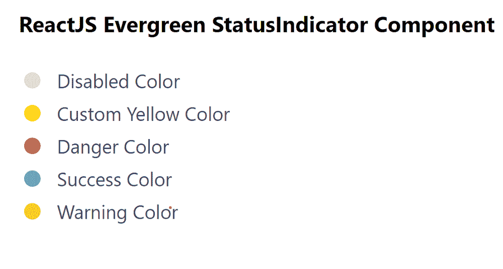

# 重新获得常青状态指示器组件

> 原文:[https://www . geeksforgeeks . org/reactjs-evergreen-status indicator-component/](https://www.geeksforgeeks.org/reactjs-evergreen-statusindicator-component/)

React Evergreen 是一个受欢迎的前端库，它有一组 React 组件来构建漂亮的产品，因为这个库是灵活的、合理的默认值和用户友好的。状态指示器组件允许用户显示或指示项目的状态。 我们可以在 ReactJS 中使用以下方法来使用长青状态指示器组件。

**状态指标推进力:**

*   **children:** 用于表示状态提示的标签。
*   **颜色:**用于表示状态提示的颜色。
*   **点大小:**用于表示文本左边点的大小

**创建反应应用程序并安装模块:**

*   **步骤 1:** 使用以下命令创建一个反应应用程序:

    ```
    npx create-react-app foldername
    ```

*   **步骤 2:** 在创建项目文件夹(即文件夹名**)后，使用以下命令将**移动到该文件夹:

    ```
    cd foldername
    ```

*   **步骤 3:** 创建 ReactJS 应用程序后，使用以下命令安装所需的****模块:****

    ```
    **npm install evergreen-ui**
    ```

******项目结构:**如下图。****

****

项目结构**** 

******示例:**现在在 **App.js** 文件中写下以下代码。在这里，App 是我们编写代码的默认组件。****

## ****App.js****

```
**import React from 'react'
import { StatusIndicator } from 'evergreen-ui'

export default function App() {

  return (
    <div style={{
      display: 'block', width: 700, paddingLeft: 30
    }}>
      <h4>ReactJS Evergreen StatusIndicator Component</h4>
      <StatusIndicator dotSize={20} color="disabled">
          Disabled Color
      </StatusIndicator> 
      </br>
      <StatusIndicator dotSize={20} color="yellow">
          Custom Yellow Color
      </StatusIndicator> 
      </br>
      <StatusIndicator dotSize={20} color="danger">
          Danger Color
      </StatusIndicator>
      </br>
      <StatusIndicator dotSize={20} color="success">
          Success Color
      </StatusIndicator> 
      </br>
      <StatusIndicator dotSize={20} color="warning">
          Warning Color
      </StatusIndicator>
    </div>
  );
}**
```

******运行应用程序的步骤:**从项目的根目录使用以下命令运行应用程序:****

```
**npm start**
```

******输出:**现在打开浏览器，转到***http://localhost:3000/***，会看到如下输出:****

********

******参考:**T2】https://evergreen.segment.com/components/status-indicator****