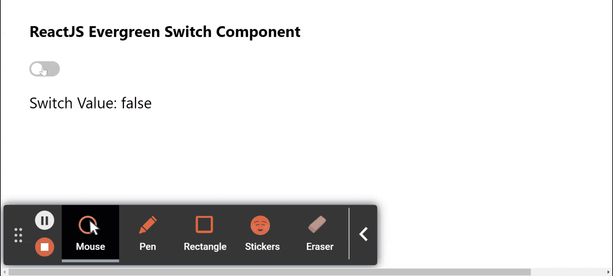

# 反应堆常青开关组件

> 原文:[https://www . geesforgeks . org/reactjs-evergreen-switch-component/](https://www.geeksforgeeks.org/reactjs-evergreen-switch-component/)

React Evergreen 是一个受欢迎的前端库，它有一组 React 组件来构建漂亮的产品，因为这个库是灵活的、合理的默认值和用户友好的。开关组件允许用户打开或关闭单个设置的状态。我们可以在 ReactJS 中使用以下方法来使用常青树开关组件。

**切换道具:**

*   **id:** 用于表示电台的 *id* 属性。
*   **名称:**用于定义电台的名称属性。
*   **值:**用于表示电台的价值属性。
*   **高度:**用于定义开关的高度。
*   **已检查:**当设置为真时，检查开关。
*   **onChange:** 是状态改变时调用的函数。
*   **禁用:**当设置为真时，开关禁用。
*   **无效:**当设置为真时，开关无效。
*   **外观:**用于复选框的外观。
*   **有一个检查图标:**当设置为真时，开关有一个检查图标。
*   **默认选中:**当设置为真时，开关默认为真。

**创建反应应用程序并安装模块:**

*   **步骤 1:** 使用以下命令创建一个反应应用程序:

    ```jsx
    npx create-react-app foldername
    ```

*   **步骤 2:** 在创建项目文件夹(即文件夹名**)后，使用以下命令将**移动到该文件夹:

    ```jsx
    cd foldername
    ```

*   **步骤 3:** 创建 ReactJS 应用程序后，使用以下命令安装所需的****模块:****

    ```jsx
    **npm install evergreen-ui**
    ```

******项目结构:**如下图。****

****

项目结构**** 

******示例:**现在在 **App.js** 文件中写下以下代码。在这里，App 是我们编写代码的默认组件。****

## ****App.js****

```jsx
**import React from 'react'
import { Switch } from 'evergreen-ui'

export default function App() {

  const [value, setValue] = React.useState(false)

  return (
    <div style={{
      display: 'block', width: 700, paddingLeft: 30
    }}>
      <h4>ReactJS Evergreen Switch Component</h4>
      <Switch checked={value} onChange={() => setValue(!value)} />
      <p>Switch Value: {`${value}`} </p>
    </div>
  );
}**
```

******运行应用程序的步骤:**从项目的根目录使用以下命令运行应用程序:****

```jsx
**npm start**
```

******输出:**现在打开浏览器，转到***http://localhost:3000/***，会看到如下输出:****

********

******参考:**T2】https://evergreen.segment.com/components/switch****