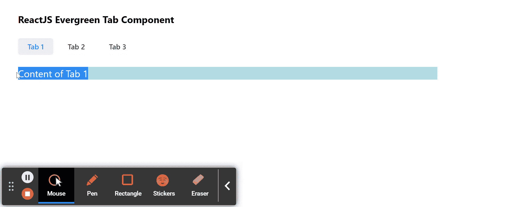

# 重新连接常青标签组件

> 原文:[https://www . geeksforgeeks . org/reactjs-evergreen-tab-component/](https://www.geeksforgeeks.org/reactjs-evergreen-tab-component/)

React Evergreen 是一个受欢迎的前端库，它有一组 React 组件来构建漂亮的产品，因为这个库是灵活的、合理的默认值和用户友好的。标签组件允许用户在给定的不同标签中的组件之间切换。它用于将我们的内容组织成逻辑组。我们可以在 ReactJS 中使用以下方法来使用常青树标签组件。

**侧边道具:**这个不接受任何道具。

**标签道具:**

*   **onSelect:** 是选择标签时触发的回调函数。
*   **选择:**当设置为真时，选项卡被选择。
*   **外观:**用于表示标签的外观。
*   **方向:**用于表示拉环的方向性。
*   **类名:**用于表示传递给 Tab 的类名。

**TabNavigation 道具:**这个不接受任何道具。

**小报道具:**这个不接受任何道具。

**创建反应应用程序并安装模块:**

*   **步骤 1:** 使用以下命令创建一个反应应用程序:

    ```jsx
    npx create-react-app foldername
    ```

*   **步骤 2:** 创建项目文件夹(即文件夹名**)后，使用以下命令移动到该文件夹中:**

    ```jsx
    cd foldername
    ```

*   **步骤 3:** 创建 ReactJS 应用程序后，使用以下命令安装所需的****模块:****

    ```jsx
    **npm install evergreen-ui**
    ```

******项目结构:**如下图。****

****

项目结构**** 

******示例:**现在在 **App.js** 文件中写下以下代码。在这里，App 是我们编写代码的默认组件。****

## ****App.js****

```jsx
**import React from 'react'
import { Pane, Tab, Tablist } from 'evergreen-ui'

export default function App() {

  // State for Selected Index
  const [indexSelected, setIndexSelected] = React.useState(0)

  // Tabs Heading Array
  const [tabsHeading] = React.useState(['Tab 1', 'Tab 2', 'Tab 3'])

  // Tabs Content Array
  const [tabsContent] = React.useState(['Content of Tab 1',
    'Content of Tab 2', 'Content of Tab 3'])

  return (
    <div style={{
      display: 'block', width: 700, paddingLeft: 30
    }}>
      <h4>ReactJS Evergreen Tab Component</h4>
      <Pane height={120}>
        <Tablist marginBottom={20} >
          {tabsHeading.map((tab, index) => (
            <Tab
              key={tab}
              isSelected={index === indexSelected}
              onSelect={() => setIndexSelected(index)}
            >{tab}</Tab>
          ))}
        </Tablist>
        <Pane background="lightblue" flex="1">
          {tabsContent.map((tab, index) => (
            <Pane
              role="tabpanel"
              key={tab}
              display={index === indexSelected ? 'block' : 'none'}
            >{tab}</Pane>
          ))}
        </Pane>
      </Pane>
    </div>
  );
}**
```

******运行应用程序的步骤:**从项目的根目录使用以下命令运行应用程序:****

```jsx
**npm start**
```

******输出:**现在打开浏览器，转到***http://localhost:3000/***，会看到如下输出:****

********

******参考:**T2】https://evergreen.segment.com/components/tabs****