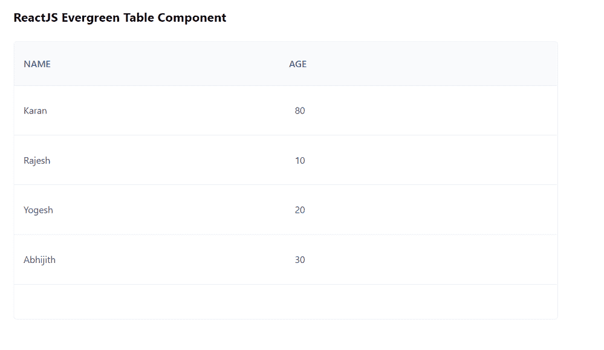

# 反应堆常青表组件

> 原文:[https://www . geeksforgeeks . org/reactjs-evergreen-table-component/](https://www.geeksforgeeks.org/reactjs-evergreen-table-component/)

React Evergreen 是一个受欢迎的前端库，它有一组 React 组件来构建漂亮的产品，因为这个库是灵活的、合理的默认值和用户友好的。表格组件允许用户显示表格格式的所有信息。我们可以在 ReactJS 中使用以下方法来使用长青表组件。

**可编辑单元命题:**

*   **是可选择的:**用于表示该元素是否可选择。
*   **禁用:**当设置为真时，无法编辑单元格。
*   **占位符:**用于表示表格的占位符值。
*   **大小:**用于表示文本表格单元格和文本区域的大小。
*   **children:** 它用来表示单元格值的 children。
*   **onChange:** 是值变化时调用的函数。
*   **自动对焦:**当设置为真时，单元格将在编辑状态下初始化。

**可编辑的 CellField 道具:**

*   **值:**用于表示文本区域的默认值。
*   **zIndex:** 用于表示放置在元素上的 z 索引。
*   **getTargetRef:** 是获取父级的目标 Ref 的函数。
*   **最小宽度:**用于表示文本区域的最小宽度。
*   **明八:**用于表示文本区域的最小高度。
*   **onChangeComplete:** 是文本区域模糊时调用的函数。
*   **onCancel:** 这是一个在命中 Escape 或 componentWillUnmount 时调用的函数。
*   **大小:**用于表示文本区域的文本大小。

**滚动推进式推进式推进式推进式推进式推进式推进式推进式推进式推进式推进式推进式推进式推进式推进式推进式推进式推进式推进式推进式推进式推进式推进式推进式推进式推进式推进式推进式推进式推进式推进式推进式推进式推进式**

*   **handleScrollbarSize:** 是一个通过创建隐藏的固定 div 返回滚动条大小的函数。

**search tableheader cell props**

*   **值:**用于表示输入的值。
*   **onChange:** 是输入变化时调用的函数。
*   **自动对焦:**用于设置组件是否应自动对焦在组件渲染上。
*   **拼写检查:**用于设置是否对内容进行拼写检查。
*   **占位符:**用于表示输入为空时在输入中显示的文本。
*   **图标:**用于表示标签前的常青树或自定义图标。

**SelectMenuCell Props:**

*   **是可选择的:**用于表示该元素是否可选择。
*   **禁用:**当设置为真时，无法编辑单元格。
*   **占位符:**用于表示表格的占位符值。
*   **大小:**用于表示文本表格单元格和文本区域的大小。
*   **选择菜单道具:**用于表示选择菜单道具。

**表道具:**不带任何道具。

**表体道具:**不带任何道具。

**表格单元命题:**

*   **是可选择的:**用于表示该元素是否可选择。
*   **外观:**用于表格行的外观。
*   **rightView:** 用于制作一个可选节点，放置在表格单元格的右侧。
*   **箭头键覆盖:**用于允许前进箭头键覆盖可选单元格。
*   **类名:**用于将类名传递给表格单元格。

**桌面道具:**

*   **高度:**用于表示台面高度。
*   **account for crollbar:**如果同时使用 TableHead 和 TableBody，这些道具应该设置为 true always。

**TableHeaderCell 道具:**不需要任何道具。

**表格列命题:**

*   **高度:**用来表示行的高度。
*   **onSelect:** 这是一个在点击和回车/空格键时触发的功能。
*   **on select:**这是一个在点击和回车/空格键时触发的功能。
*   **是可选择的:**用于使 TableRow 可选择。
*   **选择:**用于选择表格行。
*   **ishighlight:**用于手动设置要高亮显示的 TableRow。
*   **意图:**用于表示警报的意图。
*   **外观:**用于表格行的外观。
*   **类名:**用于表示传递给表行的类名。

**TableVirtualBody 道具:**

*   **子元素:**用于表示子元素，是单个节点的数组。
*   **默认高度:**用于表示每行的默认高度。
*   **允许高度:**如果该道具设置为真，则允许自动高度。
*   **over cancount:**用于表示传递给 react-micro-virtual-list 的 over cancount 属性。
*   **estimatemitemsize:**当 allowAutoHeight 和 seaverageautoheight 估计道具设置为 false 时，此道具用作反应微小虚拟列表中的 estimatemitemsize。
*   **使用平均自动高度估计:**当允许高度和此道具设置为真时，估计高度将根据自动高度行的平均高度计算。
*   **scroltoindex:**用于表示传递给 react-tiny-virtual-list 的 scroltoindex 属性。
*   **scrollOffset:** 用于表示传递给反应-微小-虚拟-列表的 scrollOffset 属性。
*   **scroltoalignment:**用于表示传递给 reaction-tiny-virtual-list 的 scroltoalignment 属性。
*   **onScroll:** 它是 onScroll 的回调，被传递到反应-微小-虚拟-列表。

**文本桌面单元格道具：**

*   **是编号:**用于添加 *mono* 值的 fontFamily。
*   **文本道具:**用于将附加道具传递给文本组件。

**文本桌面标题单元格道具：**

*   **文本道具:**用于将附加道具传递给文本组件。

**创建反应应用程序并安装模块:**

*   **步骤 1:** 使用以下命令创建一个反应应用程序:

    ```
    npx create-react-app foldername
    ```

*   **步骤 2:** 创建项目文件夹(即文件夹名**)后，使用以下命令移动到该文件夹中:**

    ```
    cd foldername
    ```

*   **步骤 3:** 创建 ReactJS 应用程序后，使用以下命令安装所需的****模块:****

    ```
    **npm install evergreen-ui**
    ```

******项目结构:**如下图。****

****

项目结构**** 

******示例:**现在在 **App.js** 文件中写下以下代码。在这里，App 是我们编写代码的默认组件。****

## ****App.js****

```
**import React from 'react'
import { Table } from 'evergreen-ui'

export default function App() {

  const sampleData = [
    { id: 1, name: 'Karan', age: 80 },
    { id: 3, name: 'Rajesh', age: 10 },
    { id: 4, name: 'Yogesh', age: 20 },
    { id: 5, name: 'Abhijith', age: 30 }
  ]

  return (
    <div style={{
      display: 'block', width: 700, paddingLeft: 30
    }}>
      <h4>ReactJS Evergreen Table Component</h4>
      <Table>
        <Table.Head>
          <Table.TextHeaderCell>Name</Table.TextHeaderCell>
          <Table.TextHeaderCell>Age</Table.TextHeaderCell>
        </Table.Head>
        <Table.Body height={300}>
          {sampleData.map((data) => (
            <Table.Row key={data.id}>
              <Table.TextCell>{data.name}</Table.TextCell>
              <Table.TextCell>{data.age}</Table.TextCell>
            </Table.Row>
          ))}
        </Table.Body>
      </Table>
    </div>
  );
}**
```

******运行应用程序的步骤:**从项目的根目录使用以下命令运行应用程序:****

```
**npm start**
```

******输出:**现在打开浏览器，转到***http://localhost:3000/***，会看到如下输出:****

********

******参考:**T2】https://evergreen.segment.com/components/table****