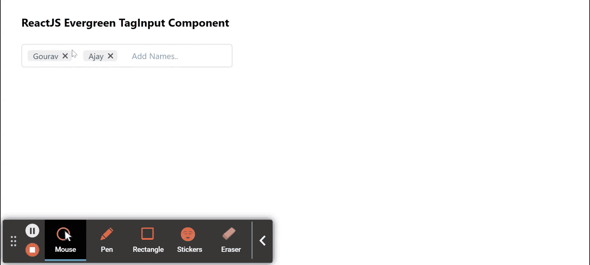

# 重新获得常青标签输入组件

> 原文:[https://www . geeksforgeeks . org/reactjs-evergreen-taginput-component/](https://www.geeksforgeeks.org/reactjs-evergreen-taginput-component/)

React Evergreen 是一个受欢迎的前端库，它有一组 React 组件来构建漂亮的产品，因为这个库是灵活的、合理的默认值和用户友好的。标签输入组件允许用户输入多个值作为标签。我们可以在 ReactJS 中使用以下方法来使用长青标记输入组件。

**标签道具:**

*   **儿童:**用于表示标签内容。
*   **onRemove:** 是点击移除图标时触发的回调函数。
*   **是可移除的:**用于指示标签是否可以移除。

**切削输入命题:**

*   **AddBull:**用于指示输入模糊时是否应该将 inputValue 添加到标签中。
*   **类名:**用于传递要应用于容器组件的类名。
*   **禁用:**用于指示输入是否应禁用。
*   **高度:**用于表示输入的垂直尺寸。
*   **输入属性:**用于表示传递给输入组件的属性。
*   **inputRef:** 用于表示输入元素的 Ref 处理程序。
*   **onAdd:** 是添加新标签时触发的回调函数。
*   **onbulr:**是一个回调函数，当输入的焦点模糊时触发。
*   **onChange:** 是一个回调函数，在标签值发生变化时触发。
*   **onFocus:** 是输入接收焦点时触发的回调函数。
*   **onInputChange:** 是输入值发生变化时触发的回调函数。
*   **onRemove:** 是一个回调函数，在标签被移除时触发。
*   **分隔符:**用于表示粘贴文本或按回车键时要拆分的数值或正则表达式。
*   **tagProps:** 用于为 tag 组件提供道具。
*   **标签提交键:**用于表示打字时为了提交新标签而按下的键。
*   **值:**用于受控标签值。

**创建反应应用程序并安装模块:**

*   **步骤 1:** 使用以下命令创建一个反应应用程序:

    ```
    npx create-react-app foldername
    ```

*   **步骤 2:** 在创建项目文件夹(即文件夹名**)后，使用以下命令将**移动到该文件夹:

    ```
    cd foldername
    ```

*   **步骤 3:** 创建 ReactJS 应用程序后，使用以下命令安装所需的****模块:****

    ```
    **npm install evergreen-ui**
    ```

******项目结构:**如下图。****

****

项目结构**** 

******示例:**现在在 **App.js** 文件中写下以下代码。在这里，App 是我们编写代码的默认组件。****

## ****App.js****

```
**import React from 'react'
import { TagInput } from 'evergreen-ui'

export default function App() {

  // State for our values
  const [values, setValues] = React.useState(['Gourav', 'Ajay'])

  return (
    <div style={{
      display: 'block', width: 700, paddingLeft: 30
    }}>
      <h4>ReactJS Evergreen TagInput Component</h4>
      <TagInput
        inputProps={{ placeholder: 'Add Names..' }}
        onChange={data => {setValues(data)}}
        values={values}
      />
    </div>
  );
}**
```

******运行应用程序的步骤:**从项目的根目录使用以下命令运行应用程序:****

```
**npm start**
```

******输出:**现在打开浏览器，转到***http://localhost:3000/***，会看到如下输出:****

********

******参考:**T2】https://evergreen.segment.com/components/tag-input****