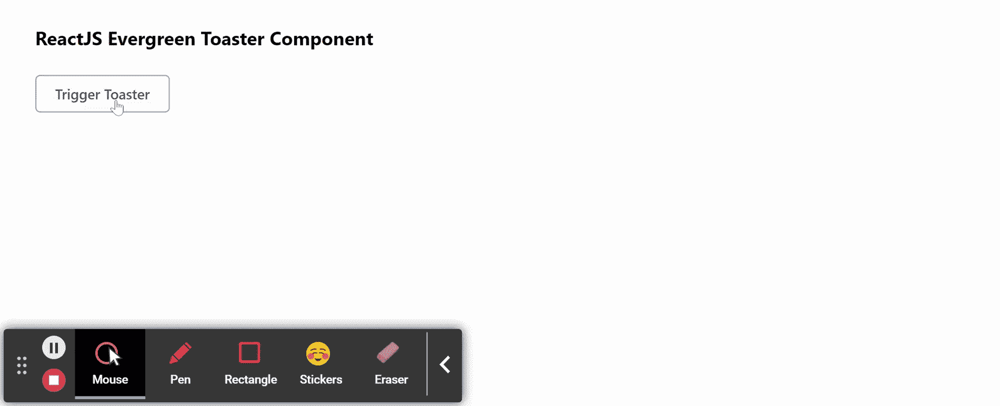

# ReactJS 常青烤面包机组件

> 原文:[https://www . geeksforgeeks . org/reactjs-evergreen-烤面包机-component/](https://www.geeksforgeeks.org/reactjs-evergreen-toaster-component/)

React Evergreen 是一个受欢迎的前端库，它有一组 React 组件来构建漂亮的产品，因为这个库是灵活的、合理的默认值和用户友好的。烤面包机组件允许用户显示一条短暂的信息作为覆盖。我们可以在 ReactJS 中使用以下方法来使用常青树烤面包机组件。

**吐司道具:**

*   **zIndex:** 用来表示吐司的 z-index。
*   **时长:**用来表示吐司的时长。
*   **onRemove:** 是一个回拨功能，在吐司一路关闭时触发。
*   **意图:**用于表示警报的类型。
*   **标题:**用于表示预警的标题。
*   **子级:**用于定义预警的描述。
*   **hasCloseButton:** 设置为 true 时，用于在吐司内部显示关闭图标按钮。
*   **isShown:** 用于关闭吐司并调用*上的*当完成时，该选项设置为假。

**毛巾管理员提议:**

*   **绑定通知:**是通过 *this.notify* 功能触发的功能。
*   **绑定删除:**是通过 *this.remove* 功能触发的功能。
*   **bingettoast:**是通过*this . gettoast*功能触发的功能。
*   **bindCloseAll:** 是通过 *this.closeAll* 功能触发的功能。

**创建反应应用程序并安装模块:**

*   **步骤 1:** 使用以下命令创建一个反应应用程序:

    ```jsx
    npx create-react-app foldername
    ```

*   **步骤 2:** 在创建项目文件夹(即文件夹名**)后，使用以下命令将**移动到该文件夹:

    ```jsx
    cd foldername
    ```

*   **步骤 3:** 创建 ReactJS 应用程序后，使用以下命令安装所需的****模块:****

    ```jsx
    **npm install evergreen-ui**
    ```

******项目结构:**如下图。****

****

项目结构**** 

******示例:**现在在 **App.js** 文件中写下以下代码。在这里，App 是我们编写代码的默认组件。****

## ****App.js****

```jsx
**import React from 'react'
import { Button, toaster } from 'evergreen-ui'

export default function App() {

  // Function using toaster notify
  const customNotify = () => {
    toaster.notify('Greetings from GeeksforGeeks')
  }

  return (
    <div style={{
      display: 'block', width: 700, paddingLeft: 30
    }}>
      <h4>ReactJS Evergreen Toaster Component</h4>
      <Button onClick={customNotify}>
        Trigger Toaster
        </Button>
    </div>
  );
}**
```

******运行应用程序的步骤:**从项目的根目录使用以下命令运行应用程序:****

```jsx
**npm start**
```

******输出:**现在打开浏览器，转到***http://localhost:3000/***，会看到如下输出:****

********

******参考:**T2】https://evergreen.segment.com/components/toaster****