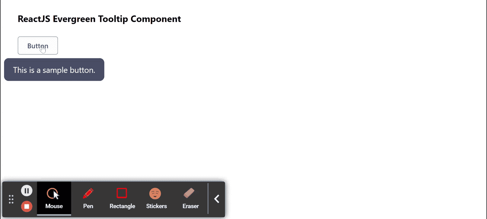

# 重新获得常青树工具提示组件

> 原文:[https://www . geeksforgeeks . org/reactjs-evergreen-tooltip-component/](https://www.geeksforgeeks.org/reactjs-evergreen-tooltip-component/)

React Evergreen 是一个受欢迎的前端库，它有一组 React 组件来构建漂亮的产品，因为这个库是灵活的、合理的默认值和用户友好的。工具提示组件允许用户在悬停、聚焦或点击元素时显示信息文本。我们可以在 ReactJS 中使用以下方法来使用常青树工具提示组件。

**工具提示道具：**

*   **外观:**用于工具提示的外观。
*   **位置:**用于定位波波夫。
*   **含量:**用于表示波波夫的含量。
*   **隐藏延迟:**用于表示隐藏工具提示前的时间，单位为毫秒。
*   **显示延迟:**用于表示工具提示显示前的时间，单位为毫秒。
*   **显示:**当设置为真时，手动显示工具提示。
*   **子级:**用于工具提示的目标按钮。
*   **状态道具:**用于定义传递给工具提示的属性。

**工具提示无道具:**

*   **children:** 用于将 children 元素传递给这个组件。
*   **外观:**用于工具提示的外观。

**创建反应应用程序并安装模块:**

*   **步骤 1:** 使用以下命令创建一个反应应用程序:

    ```
    npx create-react-app foldername
    ```

*   **步骤 2:** 创建项目文件夹(即文件夹名**)后，使用以下命令移动到该文件夹中:**

    ```
    cd foldername
    ```

*   **步骤 3:** 创建 ReactJS 应用程序后，使用以下命令安装所需的****模块:****

    ```
    **npm install evergreen-ui**
    ```

******项目结构:**如下图。****

****

项目结构**** 

******示例:**现在在 **App.js** 文件中写下以下代码。在这里，App 是我们编写代码的默认组件。****

## ****App.js****

```
**import React from 'react'
import { Tooltip, Button } from 'evergreen-ui'

export default function App() {

  return (
    <div style={{
      display: 'block', width: 700, paddingLeft: 30
    }}>
      <h4>ReactJS Evergreen Tooltip Component</h4>
      <Tooltip content="This is a sample button.">
        <Button>Button</Button>
      </Tooltip>
    </div>
  );
}**
```

******运行应用程序的步骤:**从项目的根目录使用以下命令运行应用程序:****

```
**npm start**
```

******输出:**现在打开浏览器，转到***http://localhost:3000/***，会看到如下输出:****

********

******参考:**T2】https://evergreen.segment.com/components/tooltip****