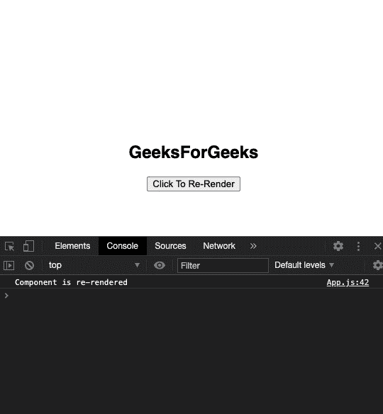

# ReactJS forceUpdate()方法

> 原文:[https://www.geeksforgeeks.org/reactjs-forceupdate-method/](https://www.geeksforgeeks.org/reactjs-forceupdate-method/)

只有当组件或传递给它的道具的状态发生变化时，React 中的组件才会重新渲染，但是如果我们需要重新渲染组件，如果某些数据发生变化，那么我们将使用 forceUpdate()方法进行 React。调用 forceUpdate()将强制重新呈现组件，从而调用组件的 render()方法，跳过 shouldComponentUpdate()方法。

**提示:**通常情况下，避免使用 forceUpdate()的所有功能，只在 render()中读取 this.props 和 this.state。

**语法:**

```
component.forceUpdate(callback)
```

虽然使用 forceUpdate()方法肯定有一些用例，但是最好在需要的时候使用钩子、道具、状态和上下文来重新呈现组件。

**创建反应应用程序:**

**步骤 1:** 使用以下命令创建一个反应应用程序:

```
npx create-react-app functiondemo
```

**步骤 2:** 创建项目文件夹(即 functiondemo)后，使用以下命令移动到该文件夹:

```
cd functiondemo
```

**项目结构:**如下图。


项目结构

**示例:**在本例中，我们将构建一个 React 应用程序，通过调用 forceUpdate()方法，在单击按钮时重新呈现组件。

**App.js:** 现在在 App.js 文件中写下以下代码。在这里，App 是我们编写代码的默认组件。

## java 描述语言

```
import React from 'react';

class App extends React.Component {
  reRender = () => {
    // calling the forceUpdate() method
    this.forceUpdate();
  };
  render() {

    console.log('Component is re-rendered');
    return (
      <div>
        <h2>GeeksForGeeks</h2>
        <button onClick={this.reRender}>Click To Re-Render</button>
      </div>
    );
  }
}
export default App;
```

**注意:**可以将自己的造型应用到应用中。

**运行应用程序的步骤:**从项目的根目录使用以下命令运行应用程序:

```
npm start
```

**输出:**

