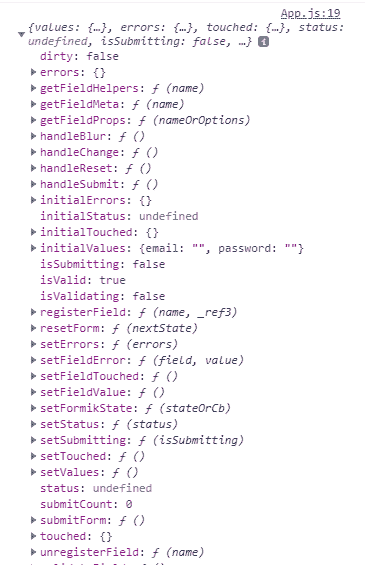

# 使用 Formik 和 Yep

重新进行表单验证

> 原文:[https://www . geeksforgeeks . org/reactjs-form-validation-using-formik-and-Yep/](https://www.geeksforgeeks.org/reactjs-form-validation-using-formik-and-yup/)

正如在[上一篇文章](https://www.geeksforgeeks.org/reactjs-forms/)中所述，我们可以使用受控组件来验证表单。但是，如果我们在网站的许多地方需要表单，这可能会很耗时，并且代码的长度可能会增加。福米克和耶来救援了！Formik 旨在轻松管理具有复杂验证的表单。Formik 支持同步和异步的表单级和字段级验证。此外，它还通过“是”支持基于模式的表单级验证。我们还会使用引导，这样我们就不会浪费时间在 HTML 和 CSS 上。

下面是如何使用 Formik 和 yey 进行表单验证的分步实现。

**步骤 1:** 创建 React 应用程序并安装模块:

```
npx create-react-app react-form
```


**步骤 2:** 创建项目文件夹(即 react-form)后，使用以下命令移动到该文件夹:

```
cd react-form
```

**第 3 步:**然后添加引导(如果你想可以创建自己的样式，这是可选的)。

```
yarn add bootstrap
```


**第四步:**我们可以继续添加 Formik 和 Yep。

```
yarn add formik yup
```


**项目结构**:如下图。


项目结构

**注意:**我们将把整个代码写在 **App.js** 文件中。在这里，App 是我们编写代码的默认组件。

**第五步:** < Formik >是一个帮助你构建形态的组件。InitialValues 是一个初始化表单中所有字段的工具。通常，初始化是一个空字符串，但在某些字段中，您可能需要初始值。

## java 描述语言

```
<Formik
      initialValues={{
        email: "",
        password: ""
      }}
>
```

**第六步:**我们正在添加一个代码块，在这个代码块中我们正在传递由 Formik 提供的**道具**，并且我们正在控制台上打印道具对象。然后我们使用 Bootstrap 提供的 **<表单>** 组件，其中我们再次传递 2 个组件，即 **<标签>** 和 **<字段>** 组件。最后，我们使用引导<按钮>组件提交表单。应包装在 formik 内的表单组件的基本锅炉代码。

## java 描述语言

```
import React from "react";
import { Formik, Form, Field } from "formik";

import "bootstrap/dist/css/bootstrap.css";

class App extends React.Component {
  render() {
    return (
      <div className="container">
        <div className="row">
          <div className="col-lg-12">
            <Formik initialValues={{ email: "", password: "" }}>
              {(props) => (
                <div>
                  {console.log(props)}
                  <div className="row mb-5">
                    <div className="col-lg-12 text-center">
                      <h1 className="mt-5">Login Form</h1>
                    </div>
                  </div>
                  <Form>
                    <div className="form-group">
                      <label htmlFor="email">Email</label>
                      <Field
                        type="email"
                        name="email"
                        placeholder="Enter email"
                        autoComplete="off"
                      />
                    </div>

                    <div className="form-group">
                      <label htmlFor="password" className="mt-3">
                        Password
                      </label>
                      <Field
                        type="password"
                        name="password"
                        placeholder="Enter password"
                      />
                    </div>

                    <button
                      type="submit"
                      className="btn btn-primary btn-block mt-4"
                    >
                      Submit
                    </button>
                  </Form>
                </div>
              )}
            </Formik>
          </div>
        </div>
      </div>
    );
  }
}

export default App;
```

**第 7 步:**如前所述，我们添加了一个接受参数的函数(假设是 props)，我们已经将表单包装在 formik 组件中，然后我们打印了 props 参数，这样我们就可以看到 formik 提供的各种道具。在控制台中，会显示一个对象。如果我们仔细观察，我们可以看到初始值也显示在这个对象中。



**第 8 步:**Formik 的另一个道具是 **onSubmit** ，它以**值**为参数，主要用于 post api 调用，将表单外的数据收集起来，然后我们可以将数据存储在服务器中。但在我们的例子中，我们会保持简单，只需在控制台中打印值并发出警告消息。

## java 描述语言

```
<Formik
    initialValues={{ email: "", password: "" }}
    onSubmit={(values) => {
      console.log(values)
      alert("Form is validated and in this 
        block api call should be made...");
      }
    }
>
```

**第 9 步:**此外，这里我们可以有**验证架构**道具，该道具将 YPE 对象(在本例中为**逻辑架构**)作为带有自定义验证的参数，比如我们是否希望我们的字段为:

1.  字符串:是。字符串()
2.  格式为电子邮件(验证消息) :是。电子邮件(“无效的电子邮件地址格式”)
3.  最少字符:是.分钟(长度，“验证消息”)
4.  最大字符数:是。最大(长度，“验证消息”)

## java 描述语言

```
const LoginSchema = Yup.object().shape({
  email: Yup.string()

    // Format Validation
    .email("Invalid email address format")

    // Required Field Validation
    .required("Email is required"),
  password: Yup.string()

    //Minimum Character Validation
    .min(3, "Password must be 3 characters at minimum")
    .required("Password is required")
});
```

**第 10 步:** Formik 组件包含 initialValues、ValidationSchema(绑定 Formik 和 Yep)3 个道具后，onSubmit 看起来是这样的:

## java 描述语言

```
<Formik
    initialValues={{ email: "", password: "" }}
    validationSchema={LoginSchema}
    onSubmit={(values) => {
    console.log(values)
    alert("Form is validated! Submitting the form...");
}}
>
```

道具对象的 4 个重要状态分别是**触碰**、**错误**、**发布**、**值**，足以打造高度定制的形态。

1.  **触摸**以布尔值作为输入，如果点击某个字段，则设置为真。
2.  **错误**用于显示由 YPE 对象设置的错误信息。
3.  **问题提交**在我们点击提交表单后设置为真。
4.  **值**由该时间点的所有字段值组成。


**第 11 步:**现在是**错误消息**组件，我们通常在**字段**组件下面使用它来显示由 Yep 生成的验证。我们可以添加引导类**无效反馈**进行造型。

## java 描述语言

```
<label htmlFor="email">Email</label>

<Field
  type="email"
  name="email"
  placeholder="Enter email"
  autocomplete="off"
  className={`mt-2 form-control ${touched.email 
        && errors.email ? "is-invalid" : ""}`} 
  // If there is validation error then 
  // is-invalid bootstrap class is added
/>

<ErrorMessage
  component="div"
  name="email"
  className="invalid-feedback"
/>
```

**第 12 步:**我们还没有在功能中使用**发布**道具。我们可以用它做一件有趣的事情。我们可以通过使用条件渲染和三元运算符，使用屏幕上的**值**参数来确认已经登录的用户并显示其用户名和密码。

## java 描述语言

```
isSubmitting ? (<h1>Login Page</h1>) : (<h1>Confirmation of Login</h1>)
// (condition) ? (if true this component gets displayed) :
                 (else this component gets displayed)
```

现在我们将看到上述步骤的完整代码。

## App.js

```
import React from "react";
import { Formik, Form, Field, ErrorMessage } from "formik";
import * as Yup from "yup";
import "bootstrap/dist/css/bootstrap.css";

const LoginSchema = Yup.object().shape({
  email: Yup.string()
    .email("Invalid email address format")
    .required("Email is required"),
  password: Yup.string()
    .min(3, "Password must be 3 characters at minimum")
    .required("Password is required"),
});

class App extends React.Component {
  render() {
    return (
      <div className="container">
        <div className="row">
          <div className="col-lg-12">
            <Formik
              initialValues={{ email: "", password: "" }}
              validationSchema={LoginSchema}
              onSubmit={(values) => {
                console.log(values);
                alert("Form is validated! Submitting the form...");
              }}
            >
              {({ touched, errors, isSubmitting, values }) =>
                !isSubmitting ? (
                  <div>
                    <div className="row mb-5">
                      <div className="col-lg-12 text-center">
                        <h1 className="mt-5">Login Form</h1>
                      </div>
                    </div>
                    <Form>
                      <div className="form-group">
                        <label htmlFor="email">Email</label>
                        <Field
                          type="email"
                          name="email"
                          placeholder="Enter email"
                          autocomplete="off"
                          className={`mt-2 form-control
                          ${touched.email && errors.email ? "is-invalid" : ""}`}
                        />

                        <ErrorMessage
                          component="div"
                          name="email"
                          className="invalid-feedback"
                        />
                      </div>

                      <div className="form-group">
                        <label htmlFor="password" className="mt-3">
                          Password
                        </label>
                        <Field
                          type="password"
                          name="password"
                          placeholder="Enter password"
                          className={`mt-2 form-control
                          ${
                            touched.password && errors.password
                              ? "is-invalid"
                              : ""
                          }`}
                        />
                        <ErrorMessage
                          component="div"
                          name="password"
                          className="invalid-feedback"
                        />
                      </div>

                      <button
                        type="submit"
                        className="btn btn-primary btn-block mt-4"
                      >
                        Submit
                      </button>
                    </Form>
                  </div>
                ) : (
                  <div>
                    <h1 className="p-3 mt-5">Form Submitted</h1>

                    <div className="alert alert-success mt-3">
                      Thank for your connecting with us. Here's what we got from
                      you !
                    </div>
                    <ul className="list-group">
                      <li className="list-group-item">Email: {values.email}</li>
                      <li className="list-group-item">
                        Password: {values.password}
                      </li>
                    </ul>
                  </div>
                )
              }
            </Formik>
          </div>
        </div>
      </div>
    );
  }
}

export default App;
```

**运行应用程序的步骤:**从项目的根目录使用以下命令运行应用程序:

```
npm start
```

**输出:**现在打开浏览器，转到 http://localhost:3000/，会看到如下输出:

