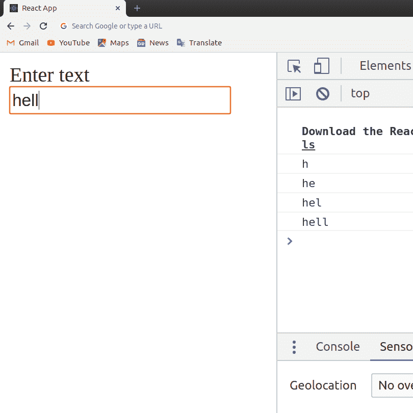
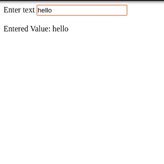
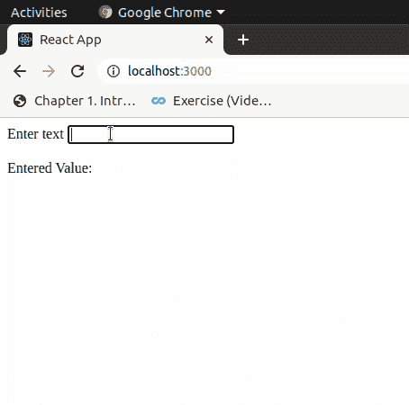

# ReactJS | forms

> 原文:[https://www.geeksforgeeks.org/reactjs-forms/](https://www.geeksforgeeks.org/reactjs-forms/)

表单在任何网站的登录、注册或其他方面都非常重要。制作表单很容易，但“反应”中的表单工作方式略有不同。如果您在 React 中制作一个简单的表单，它是可行的，但是最好在我们的表单中添加一些 JavaScript 代码，这样它就可以处理表单提交并检索用户输入的数据。为此，我们使用受控组件。
**受控组件:**在像输入标签这样的简单 HTML 元素中，只要用户键入，输入字段的值就会改变。但是，在 react 中，无论用户键入什么值，我们都将其保存在状态中，并将相同的值作为其值传递给输入标签，因此在这里，它的值不受 DOM 的更改，而是由 React 状态控制。这听起来可能很复杂，但让我们用一个例子来理解。

首先，创建 react app，并从你的项目目录更新你的 **index.js** 文件从 src 文件夹。

**src index . js:**T2】

## java 描述语言

```jsx
import React from 'react';
import ReactDOM from 'react-dom';

class App extends React.Component {

    onInputChange(event) {
        console.log(event.target.value);
    }

    render() {
        return (
            <div>
                <form>
                    <label>Enter text</label>
                    <input type="text"
                        onChange={this.onInputChange}/>
                </form>
            </div>
        );
    }
}

ReactDOM.render(<App />,
            document.querySelector('#root'));
```



在上面的例子中，无论用户在 DOM 中键入什么值，输入元素都是不受控制的。我们通过从 DOM 中获取该值来将它记录在控制台上，并且每当用户键入任何内容时都会调用 onInputChange 方法，因此每次(Ctrl + Shift + F11) Google chrome 用户打开控制台时，该值都会打印在控制台上。
React 用于处理用户输入的值。

用给定的代码编辑 src/index.js:

**Src index.js:**

## java 描述语言

```jsx
import React from 'react';
import ReactDOM from 'react-dom';

class App extends React.Component {

    state = { inputValue: '' };

    render() {
        return (
        <div>
            <form>
                <label> Enter text </label>
                <input type="text"
                    value={this.state.inputValue}
                    onChange={(e) => this.setState(
                    { inputValue: e.target.value })}/>
            </form>
            <br/>
            <div>
                Entered Value: {this.state.inputValue}
            </div>
        </div>
        );
    }
}

ReactDOM.render(<App />,
            document.querySelector('#root'));
```



在上面的 react 示例中，当我们将 inputValue 状态设置为空值，并且该状态的值被提供给输入字段时，这意味着无论 inputValue 的值是什么，我们都会在输入框中看到它。每次用户通过调用 setState()函数更改输入中的值时，我们都会更新 inputValue 的值，dom 会重新呈现，因为我们使用 setState()更改了 inputValue 的值。在这里，无论用户在输入字段中键入什么，我们都可以轻松地获取该值，并将其从 React 状态传递到我们想要的任何地方。同样的情况也发生在文本区域和选择等其他元素上。下面是另一个阻止浏览器自动提交表单的示例。

**编辑 src index.js:**

## java 描述语言

```jsx
import React from 'react';
import ReactDOM from 'react-dom';

class App extends React.Component {

    state = { inputValue: '' };

    onFormSubmit = (event) => {
        event.preventDefault();
        this.setState({ inputValue: 'Hello World!'});
    }

    render() {

        return (
        <div>
            <form onSubmit={this.onFormSubmit}>
                <label> Enter text </label>
                <input type="text"
                value={this.state.inputValue}
                onChange={(e) => this.setState(
                { inputValue: e.target.value })}/>
            </form>
            <br/>
            <div>
                Entered Value: {this.state.inputValue}
            </div>
        </div>
        );
    }
}

ReactDOM.render(<App />,
        document.querySelector('#root'));
```

输出:



这里我们只需添加一个 Submit 事件处理程序，它调用 onFormSumbit 函数，并执行将 inputValue 的值替换为“Hello World！”，而 preventDefault()函数用于防止浏览器提交表单和重新加载页面。