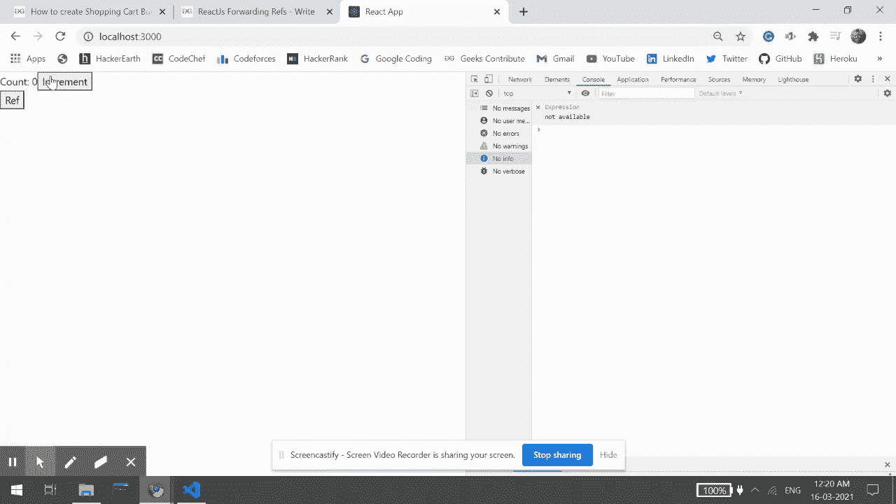

# 反应堆转发参考文献

> 原文:[https://www.geeksforgeeks.org/reactjs-forwarding-refs/](https://www.geeksforgeeks.org/reactjs-forwarding-refs/)

React 中的 forwardRef 方法允许父组件向下(或“向前”)移动引用到其子组件。ForwardRef 给子组件一个引用，引用由父组件在 React 中创建的 DOM 实体。这有助于孩子从使用元素的任何位置读取和修改元素。

【forwardRef 在 React 中是如何工作的？

在 React 中，父组件通常使用道具将数据向下传输到其子组件。假设您用一组新的道具制作了一个子组件来改变它的行为。我们需要一种方法来改变子组件的行为，而不必寻找状态或重新呈现组件。我们可以通过使用参考文献来做到这一点。我们可以使用引用来访问由元素表示的 DOM 节点。因此，我们将对其进行更改，而不会影响其状态或不得不重新呈现它。

当子组件需要引用其父组件的当前节点时，父组件必须有一种方法让子组件接收它的引用。这种技术被称为引用转发。

**语法:**

```jsx
React.forwardRef((props, ref) => {})
```

**参数:**取一个带有道具和 ref 参数的函数。

**返回值:**这个函数返回一个 JSX 元素。

**创建反应应用程序:**

**步骤 1:** 使用以下命令创建一个反应应用程序:

```jsx
npx create-react-app foldername
```

**步骤 2:** 创建项目文件夹(即文件夹名)后，使用以下命令移动到该文件夹:

```jsx
cd foldername
```

**项目结构:**如下图。


**示例:**现在在 **App.js** 文件中写下以下代码。在这里，App 是我们编写代码的默认组件。

## java 描述语言

```jsx
import React from 'react'

class App extends React.Component {
  constructor(props) {
    super(props)
    this.aRef = React.createRef()
  }
  render() {
    return (
      <>
        <Counter ref={this.aRef} />
        <button onClick={() => { console.log(this.aRef) }}>
         Ref
        </button>
      </>
    )
  }
}

const Counter = React.forwardRef((props, ref) => {
  class Counter extends React.Component {
    constructor(props) {
      super(props)
      this.state = {
        count: 0
      }
    }
    render() {
      return (
        <div>
          Count: {this.state.count}
          <button ref={ref} onClick={() => this.setState(
            { count: this.state.count + 1 })}>
                  Increment
          </button>
        </div>
      )
    }
  }
  return <Counter />
})

export default App
```

**说明:**由于计数器在函数内，所以可以使用闭包访问道具和 ref 参数。计数器被呈现并返回。传递给计数器组件的引用被设置为按钮元素的引用属性值。计数器元素的 ref 属性现在将被设置为引用按钮元素。

计数器组件由应用程序组件呈现。它从创建一个引用*开始。这个引用*被赋值给计数器组件的引用属性作为一个值。我们已经包括了一个记录 *this.aRef* 价值的按钮。 *this.aRef* 将在计数器组件中保持递增按钮的 html 按钮元素。点击参考按钮将确认它将记录 *this.aRef* 这将记录 Incr 按钮的对象。它没有记录计数器的实例，因为计数器组件将其转发给其子组件“增量”按钮。

**运行应用程序的步骤:**从项目的根目录使用以下命令运行应用程序:

```jsx
npm start
```

**输出:**现在打开浏览器，转到***http://localhost:3000/***，会看到如下输出:



**参考:**T2https://reactjs.org/docs/forwarding-refs.html