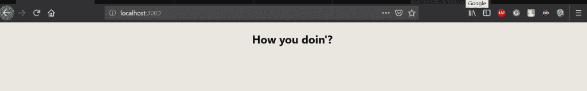

# 反应堆|热模块更换

> 原文:[https://www . geesforgeks . org/reactjs-hot-module-replacement/](https://www.geeksforgeeks.org/reactjs-hot-module-replacement/)

我们总是建议您使用 create-react-app 开始您的 react 之旅，该应用可在此找到。它节省了大量时间，因为所有基本的应用后端都是在安装后提供的，我们只剩下处理实现细节了。每当我们在 create-react-app 内部的主核心‘app . js’文件中进行更改，并访问 localhost 时，我们会看到页面在更新内容后会自行刷新。
**【app . js 文件】**

```
// using a variable and printing it in jsx
// app.js inside the src folder of create-react-app

// import statements
import React, { Component } from 'react';
import logo from './logo.svg';
import './App.css';

class App extends Component {
 // react method which is used to print
 // content on to the screen.
  render() {
    const helloWorld = `How you doin'?`;
    return (
      <div className="App">
        <h2>{helloWorld}</h2>
      </div>
    );
  }
}
// exporting the default app 
// so it can be used in other modules
export default App;
```

在上面的代码中，我们声明了一个变量，然后使用 react 提供的 render 方法打印它，这是它的一部分。在 app.js 文件中，我们编写了主 JSX( javascript XML)，它在 HTML 标签中包含了 javascript。在 JSX 之后，我们导出内容，以便 ReactDOM 可以使用它，然后最终在指定的元素中显示它。使用 ReactDOM 的“index.js”的代码如下所示:
**“index . js 文件”**

```
import React from 'react';
import ReactDOM from 'react-dom';
import './index.css';
import App from './App';
import * as serviceWorker from './serviceWorker';

ReactDOM.render(<App />, document.getElementById('root'));

// If you want your app to work offline and load faster, you can change
// unregister() to register() below. Note this comes with some pitfalls.
// Learn more about service workers: https://bit.ly/CRA-PWA
serviceWorker.unregister();
```

**输出:**


现在，每当我们对 app.js 文件进行任何类型的更改并保存它时，react 都会编译它，更改后的内容将显示在 web 上。它将在我们每次保存页面时刷新页面，尽管它建议使用热模块替换，这允许我们在浏览器中重新加载我们的应用程序，而无需刷新页面。它改善了作为开发人员的体验。为了利用这个模块，我们在“index.js”里面的代码看起来会像下面的代码:
**“更新的 index.js 文件”**

```
import React from 'react';
import ReactDOM from 'react-dom';
import './index.css';
import App from './App';
import * as serviceWorker from './serviceWorker';

ReactDOM.render(<App />, document.getElementById('root'));

// If you want your app to work offline and load faster, you can change
// unregister() to register() below. Note this comes with some pitfalls.
// Learn more about service workers: https://bit.ly/CRA-PWA
serviceWorker.unregister();

// Hot Module Replacement
if(module.hot){
    module.hot.accept();
}
```

现在，浏览器不应该刷新，尽管内容应该更新。