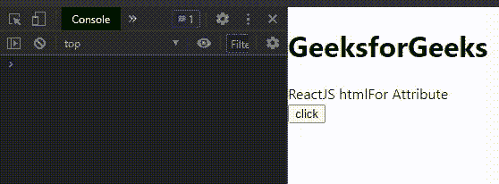

# ReactJS htmlFor 属性

> 原文:[https://www.geeksforgeeks.org/reactjs-htmlfor-attribute/](https://www.geeksforgeeks.org/reactjs-htmlfor-attribute/)

React.js 库就是将应用程序拆分成几个组件。每个组件都有自己的生命周期。React 为我们提供了一些内置的方法，我们可以在组件生命周期的特定阶段覆盖这些方法。

在基于类的组件中，htmlFor 属性用于获取给定 HTML 元素的 HTML。

**创建反应应用程序并安装模块:**

*   **步骤 1:** 使用以下命令创建一个 React 应用程序。

    ```jsx
    npx create-react-app foldername
    ```

*   **步骤 2:** 创建项目文件夹(即文件夹名)后，使用以下命令移动到该文件夹。

    ```jsx
    cd foldername
    ```

**项目结构:**如下图。


**示例:**现在在 **App.js** 文件中写下以下代码。在这里，App 是我们编写代码的默认组件。

## App.js

```jsx
import React from 'react';

// Defining our App Component
const App = () => {

  // Function to demonstrate htmlFor attribute
  function printHtmlForValue() {
    var element = document.getElementById('abc');

    // Printing element
    console.log(element)
  }

  // Returning our JSX code
  return <>
    <div>
      <h1>GeeksforGeeks</h1>
      <div id='abc'>
        ReactJS htmlFor Attribute
      </div>
      <button onClick={printHtmlForValue}>
        click
      </button>
    </div>
  </>;
}

// Exporting your Default App Component
export default App
```

**运行应用程序的步骤:**从项目的根目录使用以下命令运行应用程序:

```jsx
npm start
```

**输出:**现在打开浏览器，转到***http://localhost:3000/***，会看到如下输出:



**参考:**T2】https://reactjs.org/docs/dom-elements.html#htmlfor