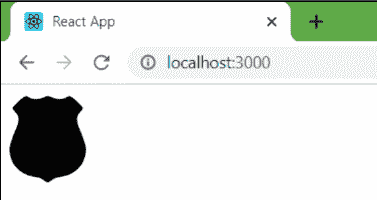
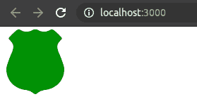
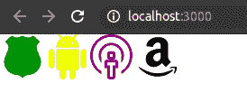

# 反应|图标

> 原文:[https://www.geeksforgeeks.org/reactjs-icons/](https://www.geeksforgeeks.org/reactjs-icons/)

React 提供了一个内置的图标库，通过使用它，我们可以在项目中包含任意数量的图标。我们只需要在我们的 **app.js** 文件中通过提到我们想要添加的库名和图标名来导入模块。

**先决条件:**

*   [ReactJS 基础知识](https://www.geeksforgeeks.org/reactjs/)
*   **NodeJS:**
    *   [在 Windows 上安装 node . js](https://www.geeksforgeeks.org/installation-of-node-js-on-windows/)
    *   [在 Linux 上安装 node . js](https://www.geeksforgeeks.org/installation-of-node-js-on-linux/)
*   [已创建 ReactJS 应用程序](https://www.geeksforgeeks.org/reactjs-setting-development-environment/)

下面按顺序描述了如何在 React 中添加和设计图标的所有步骤。

*   **第一步:**在进一步移动之前，首先你必须安装 react 图标库，通过在你的项目目录中运行以下命令，借助你的 src 文件夹中的终端，或者你也可以在你的项目文件夹中的 Visual Studio Code 的终端中运行该命令。

```jsx
npm install react-icons --save

```

*   **第二步:**安装完图标库后，现在打开你的 **app.js** 文件，该文件预设在你的项目目录中，在 src 文件夹下，删除预设在里面的代码。

*   **步骤 3:** 现在通过访问以下链接打开反应图标库。这是一个由 react 提供的内置 react 图标库。打开反应图标后，现在从菜单中选择您想要添加的图标的类别和名称。点击后，在右手边你会看到许多图标和名字。在类别中，我选择了游戏图标，从右手边我选择了**gipolicebedge**如果你愿意，你可以选择任何其他的。

> *https://react-icons.github.io/react-icons/icons?name=gi*

*   **第四步:**现在在你的 **app.js** 文件中，添加这个代码:

```jsx
import { IconName } from "react-icons/";

```

**app.js:**

## java 描述语言

```jsx
import React, { Component } from "react";

// gi is sort name of game icon.
import { GiPoliceBadge } from "react-icons/gi";

// The GiPoliceBadge is icon name.
class App extends Component {
    render() {
        return (
            <div>
                <GiPoliceBadge /> 
            </div>
        );
    }
}
export default App;
```

**输出:**

*   查看命令下的输出运行。

```jsx
npm start
```

*   现在，在 npm 成功启动后，打开浏览器并在下面键入 url 以查看输出。

```jsx
http://localhost:3000/
```



**app.js:** 要更改图标的颜色和大小，请参见下面的代码。

## java 描述语言

```jsx
import React, { Component } from "react";

// gi is sort name of game icon.
import { GiPoliceBadge } from "react-icons/gi";

// The GiPoliceBadge is icon name.
class App extends Component {
    render() {
        return (
            <div>
                <GiPoliceBadge size="100px" color="green"/> 
            </div>
        );
    }
}
export default App;
```

**输出:**



**app.js:** 添加多个图标，见下图

## java 描述语言

```jsx
import React, { Component } from "react";

// gi is sort name of game icon.
import { GiPoliceBadge } from "react-icons/gi";
import { MdAndroid } from "react-icons/md";
import { GoBroadcast } from "react-icons/go";
import { FaAmazon } from "react-icons/fa";
// The GiPoliceBadge is icon name.
class App extends Component {
    render() {
        return (
            <div>
                <GiPoliceBadge size="50px" color="green"/>
                <MdAndroid size="50px" color="yellow" />
                <GoBroadcast size="50px" color="purple"/> 
                <FaAmazon size="50px" color="black" /> 
            </div>
        );
    }
}
export default App;
```

**输出:**

