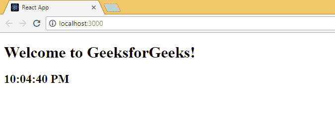

# 反应|实施状态&生命周期

> 原文:[https://www . geeksforgeeks . org/reactjs-implementing-state-life cycle/](https://www.geeksforgeeks.org/reactjs-implementing-state-lifecycle/)

到目前为止，我们已经看到了什么是 React 网络应用程序，React 组件的状态和生命周期。我们还创建了一个基本时钟，使用一个函数来每秒钟重新呈现页面，如果你认为这可以在有或没有反应的情况下实现。React 不建议使用多次呈现，而是使用有状态的方法，一旦状态改变，页面就会被重新呈现。
本文的目标是采用我们在[上一篇文章](https://www.geeksforgeeks.org/reactjs-rendering-elements/)中编写的代码，并创建一个有状态的解决方案来帮助我们实现相同的结果。首先让我们回顾一下我们在上一篇文章中开发的内容，

打开您的 react 项目目录，从 src 文件夹中编辑 **Index.js** 文件:

**src index . js:**T2】

## java 描述语言

```
import React from 'react';
import ReactDOM from 'react-dom';

function showTime()
{
const myElement = (
                   <div>
                        <h1>Welcome to GeeksforGeeks!</h1>
                        <h2>{new Date().toLocaleTimeString()}</h2>
                   </div>
                  );

ReactDOM.render(
      myElement,
      document.getElementById("root")
);                   
}

setInterval(showTime, 1000)
```

**现在上面例子中的组件是什么？**其实如果你注意的话，根本就没有任何成分。我们正在分配一个名为“myElement”的嵌套 JSX 元素来包含最新的时间，并且每秒都呈现相同的时间，这是使用 React 实现的最糟糕的方式之一。现在我们将开始使用状态和生命周期方法来实现它，这将需要一个有类组件，让我们从预先创建一个开始。

打开您的 react 项目目录，从 src 文件夹中编辑 **Index.js** 文件:

**src index . js:**T2】

## java 描述语言

```
import React from 'react';
import ReactDOM from 'react-dom';

class Clock extends React.Component {
}
```

既然我们已经将类定义为“时钟”，我们必须首先考虑过程。“道具”是一组很少变化的属性，而“状态”是一组应该随着时间变化的可观察属性。现在，如果我们想想我们自己的情况，我们的时钟正好有两个部分，一个是标题，上面写着“欢迎来到 GeeksforGeeks！”这应该使用道具来实现，因为它在整个生命周期中不会改变；另一部分是每一秒都应该改变的时间本身。让我们只使用构造函数和 render 方法首先创建主干方法来显示标题和时间，而不需要定期更新它。

## java 描述语言

```
import React from 'react';
import ReactDOM from 'react-dom';

class Clock extends React.Component {
    constructor(props)
    {
        super(props);
        this.state = { time : new Date() };
    }

    render()
    {
        return (
            <div><h1>Welcome to { this.props.title } !</h1>
        <h2>{this.state.time}</h2></div>
    );
  }
}

ReactDOM.render(
  <Clock title="GeeksforGeeks" />,
            document.getElementById('root'));
```

现在，我们已经创建了自己的组件时钟，并呈现了我们需要的内容，我们只需要找到一种每秒更新时间的方法。现在很明显，我们必须设置一个间隔来每秒更新一次状态，这应该在时钟组件安装完成后立即进行。因此，我们必须使用生命周期函数 componentDidMount()，在这里我们将设置一个间隔来更新状态，为了使应用程序高效，我们将使用 componentDidMount()方法来清除该间隔。让我们看看下面的实现。

打开您的 react 项目目录，从 src 文件夹中编辑 **Index.js** 文件:

**src index . js:**T2】

## java 描述语言

```
import React from 'react';
import ReactDOM from 'react-dom';

class Clock extends React.Component {
    constructor(props)
    {
        super(props);
        this.state = { time : new Date() };
    }

    // As soon as the Clock is mounted.
    // Start the interval "timer".
    // Call tick() every second.
    componentDidMount()
    {
        this.timer = setInterval(
            () => this.tick(),
            1000);
    }

    // Before unmounting the Clock,
    // Clear the interval "Timer"
    // This step is a memory efficient step.
    componentWillUnmount()
    {
        clearInterval(this.timer);
    }

    // This function updates the state,
    // invokes re-render at each second.
    tick()
    {
        this.setState({
            time : new Date()
        });
    }

    render()
    {
        return (
            <div><h1>Welcome to { this.props.title } !</h1>
        <h2>{this.state.time.toLocaleTimeString()}</h2></div>
    );
  }
}

ReactDOM.render(
  <Clock title="GeeksforGeeks" />,
            document.getElementById('root'));
```

[](https://media.geeksforgeeks.org/wp-content/uploads/Renderingclock_ReactJS.gif)

**恭喜！**您刚刚使用状态、道具和一些生命周期方法创建了一个 React web 应用程序。你可能会问，就这些吗？不，它甚至不是整个盘子的一小块。请继续关注即将发布的文章，我们将深入探讨 React 并随时创建更多项目。