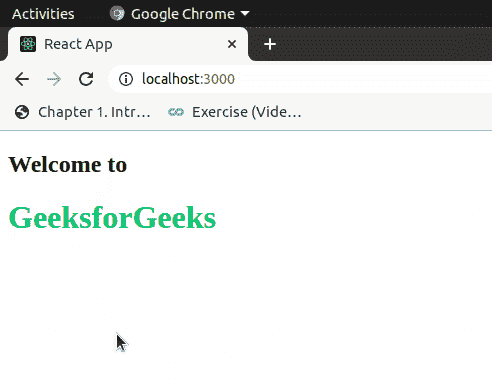

# 反应|导入和导出

> 原文:[https://www.geeksforgeeks.org/reactjs-importing-exporting/](https://www.geeksforgeeks.org/reactjs-importing-exporting/)

到目前为止，我们已经了解到 React App 基本上是一个交互组件的集合，从文章 [ReactJS Components](https://www.geeksforgeeks.org/reactjs-components/) 中，我们已经知道如何创建组件，但是即使有了这些知识，创建一个完整的 React App 也是不够的，因为为了创建一个组件集合，我们首先需要知道使用和重用可能已经在其他地方定义的组件的方法。要做到这一点，我们需要知道两个操作，通常称为导入和导出。
我们之前可能没有说过，但是我们在导入 react 和 react-dom 本身时，在之前的每篇文章中都使用了导入操作。同样，我们也可以导入用户定义的类、组件，甚至它们的一部分。让我们把讨论转移到进口上来。

**导入**

Javascript 的世界一直在移动，最新的 ES2015 之一现在提供了更高级的模块导入/导出模式。在以前的引擎中，开发人员必须使用**模块。}** ，但是现在有了 ES2015，每个模块都可以有一个默认的导出，或者可以导出几个命名参数，如果可以导出的话，肯定可以导入相同的参数。因此，对于 ES2015，每个模块都可以导入默认导出或几个命名参数，甚至一个有效的组合。
React 使用与上述相同的功能，您可以将每个 React 组件视为一个模块本身。因此，可以导入/导出反应组件，这是要执行的基本操作之一。在反应中，我们使用关键字**从**导入和**来导入特定模块或命名参数。现在让我们看看在 React 中使用导入操作的不同方法。** 

*   **导入默认导出:**每个模块据说最多有一个默认导出。为了从文件导入默认导出，我们可以只使用地址，并在它之前使用关键字 import，或者我们可以给导入命名，使语法如下。

```
import GIVEN_NAME from ADDRESS
```

*   **导入命名值:**每个模块可以有几个命名参数，为了导入一个，我们应该使用如下语法。

```
import { PARA_NAME } from ADDRESS
```

*   同样，对于多个这样的导入，我们可以使用逗号来分隔花括号中的两个参数名称。
*   **导入默认导出和命名值的组合:**标题明确了我们需要看到的是相同的语法。为了导入组合，我们应该使用以下语法。

```
import GIVEN_NAME, { PARA_NAME, ... } from ADDRESS
```

**出口**

现在，导入是一个需要模块许可的操作。只有当要导入的模块或命名属性已在其声明中导出时，才可以导入。在反应中，我们使用关键字**导出**来导出特定模块或命名参数或组合。现在让我们看看在 React 中使用导入操作的不同方法。

*   **导出默认导出:**我们已经了解到每个模块据说最多有一个默认导出。为了从文件导出默认导出，我们需要遵循下面描述的语法。

```
export default GIVEN_NAME
```

*   **导出命名值:**每个模块可以有几个命名参数，为了导出一个，我们应该使用如下语法。

```
export { PARA_NAME }
```

*   同样，对于多个这样的导出，我们可以使用逗号来分隔花括号中的两个参数名称。

让我们在下面的例子中看到它，我们可以用几种方式使用导入和导出操作。假设有两个文件，一个 **index.js** ，另一个**变色. js** 。让我们看看如何实施导入和导出操作。

这是**索引. js** 文件:

## java 描述语言

```
// Importing combination
import React, {Component} from 'react';
// Importing Module
import ReactDOM from 'react-dom';
import ChangeColor from './change-color.js';
// Importing CSS
import './index.css';

class App extends Component {
    render()
    {
        return (<div><h2>Welcome to</h2>
        <ChangeColor title="GeeksforGeeks" /></div>);
    }
}

ReactDOM.render(
  <App/>,
  document.getElementById('root')
);
```

这是**变色 js** 文件:

## java 描述语言

```
// Importing combination
import React, {Component} from 'react';

class ChangeColor extends Component {
    constructor(props)
    {
        super(props);
        this.state = { color : '#4cb96b' };
    }

    getClick()
    {
        if (this.state.color === '#4cb96b')
            this.setState({ color : '#aaa' });
        else
            this.setState({ color : '#4cb96b' });
    }

    render()
    {
        return <h1 style = { this.state }
                   onClick = {this.getClick.bind(this)}>
               {this.props.title} < /h1>
  }
} 

// Exporting the component
export default ChangeColor;
```

**输出:**



上面的代码生成了下面的应用程序，点击“极客博客”可以改变它的文本颜色。如下图所示。
现在，显然我们已经完成了创建一个自己的基本但可呈现的应用程序的所有基本要求。请继续关注，为自己创建一个。