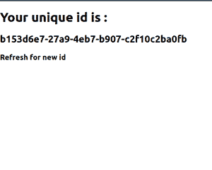

# 与其他库集成的反应

> 原文:[https://www . geeksforgeeks . org/reactjs-与其他库集成/](https://www.geeksforgeeks.org/reactjs-integrating-with-other-libraries/)

在本文中，我们将看到如何在 React 项目中集成任何 JavaScript 库。ReactJS 本身就是一个由脸书开发的 JavaScript 库。ReactJS 工作流就像首先导入东西或组件，然后在代码中使用它，您可以导出组件，并在文件中的任意位置导入。有如此多的 ReactJS 库或 JavaScript 库可用，如 uuid、toastify 等。它们可以很容易地集成到您的 ReactJS 应用程序中。

在下面的例子中，我们将集成一个非常流行的名为 *uuid* 的 JavaScript 库，它在我们每次使用 *uuid* 时都会给我们一个唯一的 *ID* 的字符串，这样我们就不需要手动给 *ID* 了。

**创建反应应用程序并安装模块:**

*   **步骤 1:** 使用以下命令创建一个 React 应用程序。

    ```
    npx create-react-app foldername
    ```

*   **步骤 2:** 创建项目文件夹(即文件夹名)后，使用以下命令移动到该文件夹。

    ```
    cd foldername
    ```

*   **步骤 3:** 创建 ReactJS 应用程序后，使用以下命令安装 ***uuid*** 模块。

    ```
    npm install uuid
    ```

**项目结构:**如下图。


项目结构

**示例:**现在在 ***App.js*** 文件中写下以下代码。在这里，App 是我们编写代码的默认组件。我们已经使用 *v4()* 方法生成了 *ID* ，并将其显示给用户，用户在刷新时会进行更改。

## App.js

```
import React from "react"
import { v4 } from "uuid"

export default function App() {
  const id = v4()
  return (
    <div>
      <h1>Your unique id is :</h1>
      <h2>{id}</h2>
      <h3>Refresh for new id</h3>
    </div>
  )
}
```

**运行应用程序的步骤:**从项目的根目录使用以下命令运行应用程序。

```
npm start
```

**输出:**现在打开浏览器，转到***http://localhost:3000/***，会看到如下输出。



与其他库反应

**参考:**T2】https://www.npmjs.com/package/uuid