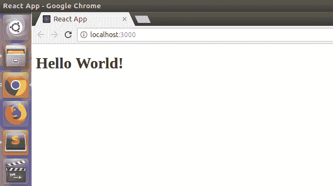

# ReactJS | JSX 简介

> 哎哎哎:# t0]https://www . geeksforgeeks . org/reacjs-introduction-jsx/

我们已经在关于 ReactJS 简介的文章中声明 React 是一个声明性的、高效的、灵活的 JavaScript 库，用于构建用户界面。但是，与其使用常规的 JavaScript，React 代码应该用一种叫做 JSX 的东西来编写。
T3】我们来看一个 JSX 代码示例:

```
const ele = <h1>This is sample JSX</h1>;
```

上面的代码片段看起来有点像 HTML，它也使用了一个类似 JavaScript 的变量，但既不是 HTML 也不是 JavaScript，它是 JSX。JSX 基本上是常规 JavaScript 的语法扩展，用于创建 React 元素。这些元素随后被渲染到反应 DOM。我们将在下一篇文章中详细了解渲染和 DOM。
**为什么是 JSX？**

*   它比普通的 JavaScript 更快，因为它在翻译成普通的 JavaScript 时会执行优化。
*   它让我们更容易创建模板。
*   React 没有在分离的文件中分离标记和逻辑，而是为此使用*组件*。我们将在后续文章中详细了解组件。

**在 JSX 使用 JavaScript 表达式:**在 React 中，我们可以对 JSX 使用正常的 JavaScript 表达式。要将任何 JavaScript 表达式嵌入到一段在 JSX 编写的代码中，我们必须将该表达式用大括号{}括起来。考虑以下写在**索引文件**中的程序:

## java 描述语言

```
import React from 'react';
import ReactDOM from 'react-dom';

const name = "Learner";

const element = <h1>Hello,
{ name }.Welcome to GeeksforGeeks.< /h1>;

ReactDOM.render(
    element,
    document.getElementById("root")
);
```

**输出:**


在上面的程序中，我们已经嵌入了 javascript 表达式*const name = " Learner "；*在我们的 JSX 代码中。顶部有几行用于导入一些 React APIs，这将在后续文章中解释。除了 if-else 语句之外，我们通过用花括号将 JSX 的任何 JavaScript 表达式包装起来，从而嵌入了它们的使用。但是在 JSX，我们可以用条件语句代替 if-else 语句。下面是条件表达式嵌入 JSX 的例子:

## java 描述语言

```
import React from 'react';
import ReactDOM from 'react-dom';

let i = 1;

const element = <h1>{ (i == 1) ? 'Hello World!' : 'False!' } < /h1>;

ReactDOM.render(
    element,
    document.getElementById("root")
);
```

**输出:**



在上面的例子中，变量 I 的值为 1。因为它等于 1，所以字符串“你好世界！”返回到 JSX 代码。如果我们修改变量 I 的值，那么将返回字符串“假”。

**JSX 的属性:** JSX 允许我们使用 HTML 元素的属性，就像我们使用普通的 HTML 一样。但是，JSX 没有使用 HTML 的常规命名约定，而是使用 camelcase 约定来表示属性。比如 HTML 中的*类*变成了 JSX 的*类名*。这背后的主要原因是 HTML 中的一些属性名，比如“类”，是 JavaScripts 中的保留关键字。所以，为了避免这个问题，JSX 对属性使用了 camel case 命名约定。我们也可以在 JSX 使用自定义属性。对于自定义属性，此类属性的名称应以 **data-** 为前缀。在下面的例子中，我们为< h2 >标签使用了一个名为 **data-sampleAttribute** 的自定义属性。

## java 描述语言

```
import React from 'react';
import ReactDOM from 'react-dom';

const element = <div><h1 className = "hello">Hello Geek</h1>
            <h2 data-sampleAttribute="sample">Custom attribute</h2>< /div>;

ReactDOM.render(
    element,
    document.getElementById("root")
);
```