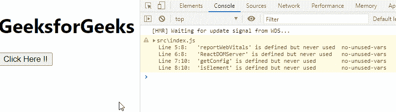

# reactjsis compositecomponentwittype()方法

> 原文:[https://www . geeksforgeeks . org/reactjs-is compositecomponentwittype-method/](https://www.geeksforgeeks.org/reactjs-iscompositecomponentwithtype-method/)

React.js 库就是将应用程序拆分成几个组件。每个组件都有自己的生命周期。React 为我们提供了一些内置的方法，我们可以在组件生命周期的特定阶段覆盖这些方法。

在本文中，我们将了解如何使用***is compositecomponentwittype**()*方法。如果组件的类型是 React componentClass，则此方法返回 true。

**创建反应应用程序并安装模块:**

*   **步骤 1:** 使用以下命令创建一个 React 应用程序。

    ```
    npx create-react-app foldername
    ```

*   **步骤 2:** 创建项目文件夹(即文件夹名)后，使用以下命令移动到该文件夹。

    ```
    cd foldername
    ```

**项目结构:**如下图。


**示例:**现在在 **App.js** 文件中写下以下代码。在这里，App 是我们编写代码的默认组件。

## App.js

```
import React from 'react';
import { isCompositeComponentWithType } from 'react-dom/test-utils';

// Defining our App Component
const App = () => {

  // Function to demonstrate isCompositeComponentWithType() method
  function func() {
    var a = isCompositeComponentWithType(el);
    console.log("The Following element is"+
                " isCompositeComponentWithType :", a);
  }

  const el = <div>
      <h1>element</h1>
  </div>

  // Returning our JSX code
  return <>
      <div id='el'>
          <h1>GeeksforGeeks</h1>
          <button onClick={func}>
           Click Here !!
          </button>
      </div>
  </>;
}

// Exporting your Default App Component
export default App
```

**运行应用程序的步骤:**从项目的根目录使用以下命令运行应用程序:

```
npm start
```

**输出:**现在打开浏览器，转到***http://localhost:3000/***，会看到如下输出:



**参考:**[https://reactjs . org/docs/test-utils . html # is compositecomponentswithtype](https://reactjs.org/docs/test-utils.html#iscompositecomponentwithtype)