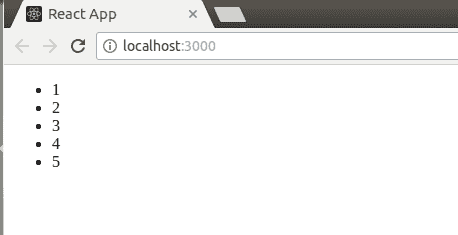
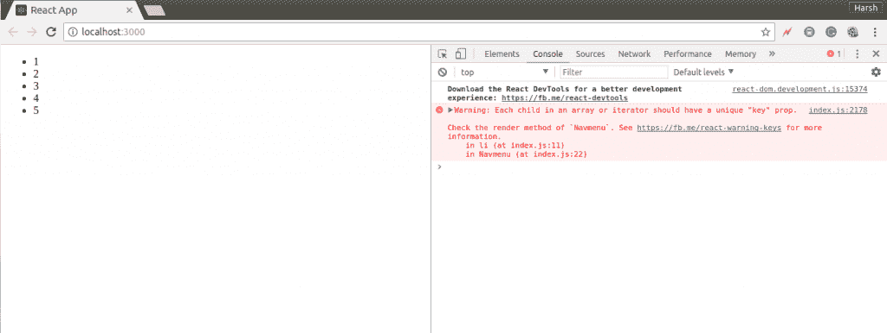

# 反应|列表

> 原文:[https://www.geeksforgeeks.org/reactjs-lists/](https://www.geeksforgeeks.org/reactjs-lists/)

在开发任何网站的用户界面时，列表都非常有用。列表主要用于显示网站中的菜单，例如 navbar 菜单。在常规的 JavaScript 中，我们可以使用[数组](https://www.geeksforgeeks.org/arrays-in-javascript/)来创建列表。我们可以像在普通 JavaScript 中一样，在 React 中创建列表。我们将在本文中进一步详细了解如何做到这一点。
首先让我们看看如何在普通 JavaScript 中遍历和更新任何列表。我们可以使用 JavaScript 中的 [map()](https://developer.mozilla.org/en-US/docs/Web/JavaScript/Reference/Global_Objects/Array/map) 函数来遍历列表。

下面的 JavaScript 代码演示了如何使用 map()函数遍历列表:

## java 描述语言

```jsx
<script type="text/javascript">
    var numbers = [1,2,3,4,5];

    const updatedNums = numbers.map((number)=>{
        return (number + 2);
    });

    console.log(updatedNums);
</script>
```

上面的代码将把下面的输出记录到控制台:

```jsx
[3, 4, 5, 6, 7]
```

现在让我们在 React 中创建一个元素列表。我们将在浏览器中将上面代码中的列表*编号*呈现为无序列表元素，而不是简单地登录到控制台。为此，我们将使用 JavaScript map()函数遍历列表，并更新要包含在<Li>T4/Li>元素之间的元素。最后，我们将把这个新列表包装在< ul > < /ul >元素中，并将其渲染到 DOM 中。

下面的代码说明了这一点:

## java 描述语言

```jsx
import React from 'react';
import ReactDOM from 'react-dom';

const numbers = [1,2,3,4,5];

const updatedNums = numbers.map((number)=>{
    return <li>{number}</li>;
});

ReactDOM.render(
    <ul>
        {updatedNums}
    </ul>, 
    document.getElementById('root')
);
```

上面的代码将呈现一个无序列表，如下输出所示:



**组件内部渲染列表**

在 React 中的上述代码中，我们已经直接将列表呈现给了 DOM。但是通常在 React 中呈现列表并不是一个好的做法。我们已经讨论了组件的用途，并且已经看到 React 中的所有内容都是作为单独的组件构建的。考虑导航菜单的例子。很明显，在任何网站中，导航菜单中的项目都不是硬编码的。该项目从数据库中提取，然后在浏览器中显示为列表。因此，从组件的角度来看，我们可以说，我们将使用道具将列表传递给组件，然后使用该组件将列表呈现给 DOM。我们可以更新上面的代码，其中我们已经直接将列表呈现为一个组件，该组件将接受一个数组作为道具并返回一个无序列表。

## java 描述语言

```jsx
import React from 'react';
import ReactDOM from 'react-dom';

// Component that will return an
// unordered list
function Navmenu(props)
{
    const list = props.menuitems;

    const updatedList = list.map((listItems)=>{
        return <li>{listItems}</li>;
    });

    return(
        <ul>{updatedList}</ul>
    );
}

const menuItems = [1,2,3,4,5];

ReactDOM.render(
    <Navmenu menuitems = {menuItems} />, 
    document.getElementById('root')
);
```

**输出:**



您可以在上面的输出中看到，无序列表已成功呈现给浏览器，但控制台上记录了一条警告消息。

```jsx
Warning: Each child in an array or iterator
         should have a unique "key" prop
```

上面的警告消息说，我们的无序列表中的每个列表项都应该有一个唯一的键。“键”是在 React 中创建元素列表时需要包含的特殊字符串属性。我们将在后续文章中详细讨论密钥。现在，让我们为上面代码中的每个列表项分配一个字符串键。

以下是带有密钥的更新代码:

## java 描述语言

```jsx
import React from 'react';
import ReactDOM from 'react-dom';

// Component that will return an
// unordered list
function Navmenu(props)
{
    const list = props.menuitems;

    const updatedList = list.map((listItems)=>{
        return(
                <li key={listItems.toString()}>
                    {listItems}
                </li>
            ); 
    });

    return(
        <ul>{updatedList}</ul>
    );
}

const menuItems = [1,2,3,4,5];

ReactDOM.render(
    <Navmenu menuitems = {menuItems} />, 
    document.getElementById('root')
);
```

这段代码将给出与前一段代码相同的输出，但这次没有任何警告。“反应”中使用键来标识列表中哪些项目被更改、更新或删除。换句话说，我们可以说键被用来给列表中的元素赋予一个身份。我们将在下一篇文章中更详细地了解密钥。