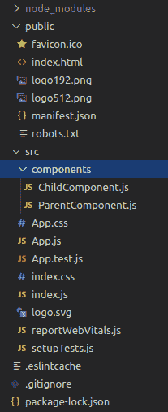
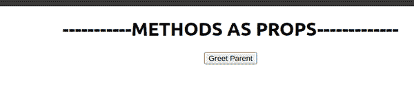

# 反应|方法作为道具

> 原文:[https://www.geeksforgeeks.org/reactjs-methods-as-props/](https://www.geeksforgeeks.org/reactjs-methods-as-props/)

[**ReactJS**](https://www.geeksforgeeks.org/react-js-introduction-working/) 是一个前端 [**JavaScript**](https://www.geeksforgeeks.org/javascript-tutorial/) 库，用于构建由脸书编写和维护的用户界面。我们知道 **ReactJS** 中的所有东西都是一个 [**组件**](https://www.geeksforgeeks.org/reactjs-components/) 为了将数据传递给这些组件，使用了 [**道具**](https://www.geeksforgeeks.org/reactjs-props-set-1/) 。虽然传入这样的道具很棒，但在应用中肯定缺乏灵活性。例如，我们不能让孩子以这种方式与父母交流。然而，这可以通过在 **ReactJS** 中传递方法作为道具来实现。

要使用方法作为支撑，所有步骤按顺序描述如下:

**项目结构**:这个项目的结构会是这样的。



**第 1 步:**为此，让我们创建一个名为 **ParentComponent.js.** 的新组件，现在让我们在这个文件中创建一个类组件的基本布局。

**亲属。js:**

## java 描述语言

```
import React, { Component } from 'react';

class ParentComponent extends Component {
    render() {
        return (
            <div>

            </div>
        )
    }
}

export default ParentComponent;
```

**第二步:**现在让我们设置一个状态来问候我们的父母每当这个组件被渲染的时候，设置一个状态是不必要的，但是我们将这样做只是为了让一个应用程序更加动态。此外，让我们创建一个事件，每当父组件被呈现时发出警报。不要忘记绑定事件，这样**这个**关键字就不会返回“**未定义的**”。

**ParentComponent.js:**

## java 描述语言

```
import React, { Component } from 'react';

class ParentComponent extends Component {
    constructor(props) {
        super(props)

        this.state = {
            parentName:'Parent'
        }

        this.greetParent = this.greetParent.bind(this)
    }

    greetParent() {
        alert(`Hello ${this.state.parentName}`)
    }

    render() {
        return (
            <div>

            </div>
        )
    }
}

export default ParentComponent;
```

**第三步:**别忘了把这个导入我们的 **App.js** 文件。

**App.js:**

## java 描述语言

```
import './App.css';
import React from 'react';

// imports component
import ParentComponent from './components/ParentComponent';

function App() {
  return (
    <div className="App">
      <h1>-----------METHODS AS PROPS-------------</h1>
      <ParentComponent />

    </div>
  );
}

export default App;
```

**第四步:**现在我们来制作一个新的组件。我们称之为**儿童组件**T5。 **js** ，并制作一个简单的功能组件。让我们制作一个简单的按钮，然后将方法**传到 greetParent()** 作为属性。本质上，当按钮被点击时，它必须问候父级。

**ChildComponent.js:**

## java 描述语言

```
import React from 'react';

function ChildComponent(props) {
    return (
        <div>
            <button onClick={() => props.greetHandler()}>
             Greet Parent
            </button>   
        </div>
    )
}

export default ChildComponent;
```

**Ste 5:** 别忘了导入**父组件**中的**子组件** 。因此**父组件** 的最终代码如下。

**ParentComponent.js:**

## java 描述语言

```
import React, { Component } from 'react';
import ChildComponent from './ChildComponent';

class ParentComponent extends Component {
    constructor(props) {
        super(props);

        this.state = {
            parentName:'Parent'
        }

        this.greetParent = this.greetParent.bind(this)
    }

    greetParent() {
        alert(`Hello ${this.state.parentName}`)
    }

    render() {
        return (
            <div>
                <ChildComponent greetHandler={this.greetParent}/>
            </div>
        )
    }
}

export default ParentComponent;
```

**输出:**

