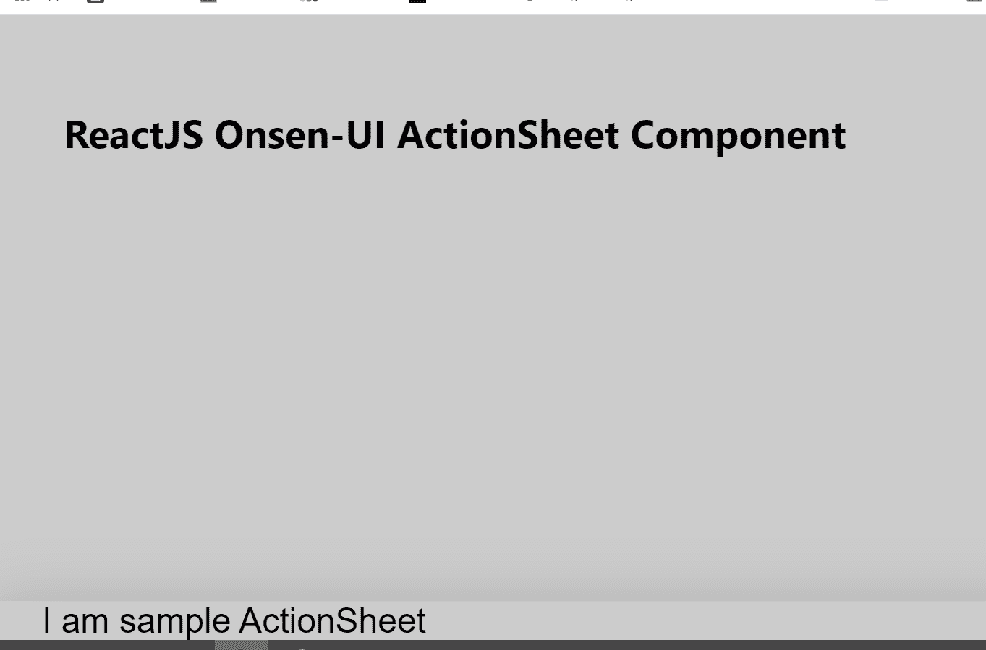

# 反应联顺 UI 动作表元件

> 原文:[https://www . geesforgeks . org/reactjs-onsen-ui-action sheet-component/](https://www.geeksforgeeks.org/reactjs-onsen-ui-actionsheet-component/)

ReactJS Onsen-UI 是一个受欢迎的前端库，具有一组 React 组件，旨在以一种美观高效的方式开发 HTML5 混合和移动网络应用程序。动作表组件允许用户显示选项列表，并要求用户做出决定。我们可以在 ReactJS 中使用以下方法来使用 Onsen-UI 动作表单组件。

**动作表建议:**

*   **onCancel:** 是一个回调函数，只有 isCancelable 为真时才会触发。
*   **isOpen:** 用于指示对话框是否打开并显示。
*   **可取消:**指定用于指定对话框是否可取消。
*   **isDisabled:** 用于指定对话框是否禁用。
*   **动画:**用于表示显示和隐藏对话框时使用的动画。
*   **修饰符:**用于表示对话框的外观。
*   **maskccolor:**用于表示背景遮罩的颜色。
*   **动画选项:**指定动画的持续时间、延迟和时间。
*   **onreshow:**是一个回调函数，刚好在动作单显示之前触发。
*   **onPostShow:** 是动作单刚显示完就触发的回调函数。
*   **onPreHide:** 是动作单隐藏前刚触发的回调函数。
*   **onpostshide:**是动作单隐藏后刚触发的回调函数。
*   **onDeviceBackButton:** 是设备后退按钮的自定义处理程序。

**预设修改器:**

*   **材料:**用于显示材料设计底稿。

**创建反应应用程序并安装模块:**

*   **步骤 1:** 使用以下命令创建一个反应应用程序:

    ```
    npx create-react-app foldername
    ```

*   **步骤 2:** 创建项目文件夹(即文件夹名**)后，使用以下命令移动到该文件夹中:**

    ```
    cd foldername
    ```

*   **步骤 3:** 创建 ReactJS 应用程序后，使用以下命令安装所需的****模块:****

    ```
    **npm install onsenui react-onsenui** 
    ```

******项目结构:**如下图。****

****

项目结构**** 

******示例:**现在在 **App.js** 文件中写下以下代码。在这里，App 是我们编写代码的默认组件。****

## ****App.js****

```
**import React from 'react';
import 'onsenui/css/onsen-css-components.css';
import { ActionSheet } from 'react-onsenui';

export default function App() {
    return (
        <div style={{
            display: 'block', width: 500, paddingLeft: 30
        }}>
            <h6>ReactJS Onsen-UI ActionSheet Component</h6>
            <ActionSheet isOpen={true} modifier={"material"}>
                <span style={{ padding: 20 }}>I am sample ActionSheet</span>
            </ActionSheet>
        </div>
    );
}**
```

******运行应用程序的步骤:**从项目的根目录使用以下命令运行应用程序:****

```
**npm start**
```

******输出:**现在打开浏览器，转到***http://localhost:3000/***，会看到如下输出:****

********

******参考:**[https://onsen . io/v2/API/reac/action sheet . html](https://onsen.io/v2/api/react/ActionSheet.html)****