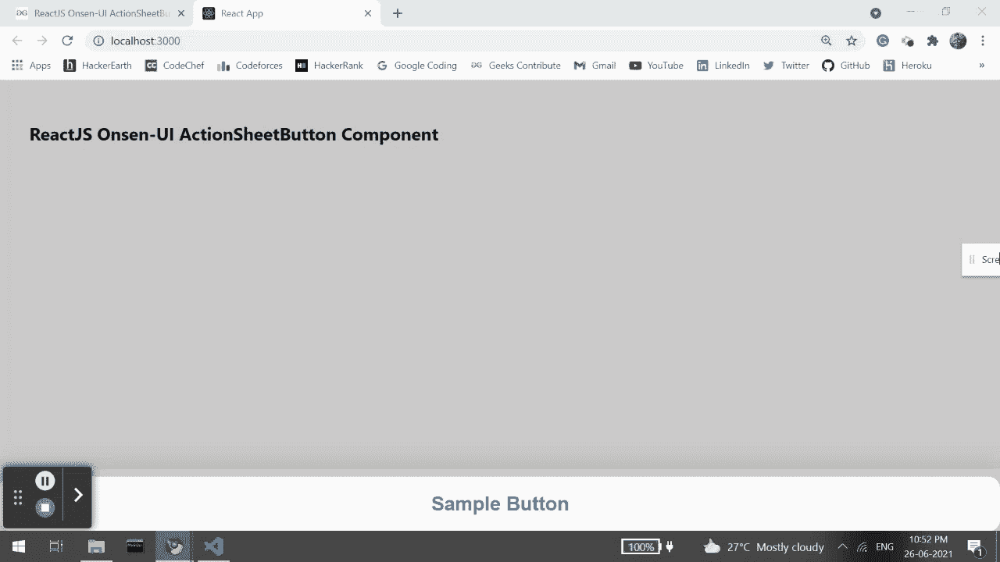

# 重新获取 Onsen 用户界面动作表单按钮组件

> 原文:[https://www . geesforgeks . org/reactjs-onsen-ui-actionsheetbutton-component/](https://www.geeksforgeeks.org/reactjs-onsen-ui-actionsheetbutton-component/)

ReactJS Onsen-UI 是一个受欢迎的前端库，具有一组 React 组件，旨在以一种美观高效的方式开发 HTML5 混合和移动网络应用程序。动作单按钮组件是用来代表动作单的每个按钮。我们可以在 ReactJS 中使用以下方法来使用 Onsen-UI ActionSheetButton 组件。

**动作表按钮提议:**

*   **修饰符:**用于表示动作单按钮的外观。
*   **图标:**用于用该字符串创建图标组件。
*   **onClick:** 是点击按钮时触发的回调函数。

**预设修改器:**

*   **破坏性:**用于显示一个*破坏性*按钮(仅适用于 iOS)。
*   **物料:**用于显示物料设计动作单按钮。

**创建反应应用程序并安装模块:**

*   **步骤 1:** 使用以下命令创建一个反应应用程序:

    ```
    npx create-react-app foldername
    ```

*   **步骤 2:** 创建项目文件夹(即文件夹名**)后，使用以下命令移动到该文件夹中:**

    ```
    cd foldername
    ```

*   **步骤 3:** 创建 ReactJS 应用程序后，使用以下命令安装所需的****模块:****

    ```
    **npm install onsenui react-onsenui** 
    ```

******项目结构:**如下图。****

****

项目结构**** 

******示例:**现在在 **App.js** 文件中写下以下代码。在这里，App 是我们编写代码的默认组件。****

## ****App.js****

```
**import React from 'react';
import 'onsenui/css/onsen-css-components.css';
import { ActionSheet, ActionSheetButton } from 'react-onsenui';

export default function App() {
    return (
        <div style={{
            display: 'block', width: 500, paddingLeft: 30
        }}>
            <h6>ReactJS Onsen-UI ActionSheetButton Component</h6>
            <ActionSheet isOpen={true} modifier={"material"}>
                <ActionSheetButton onClick={() => {
                    alert("I am sample action sheet button")
                }}>Sample Button</ActionSheetButton>
            </ActionSheet>
        </div>
    );
}**
```

******运行应用程序的步骤:**从项目的根目录使用以下命令运行应用程序:****

```
**npm start**
```

******输出:**现在打开浏览器，转到***http://localhost:3000/***，会看到如下输出:****

********

******参考:**[https://onsen . io/v2/API/reac/actionsheet button . html](https://onsen.io/v2/api/react/ActionSheetButton.html)****