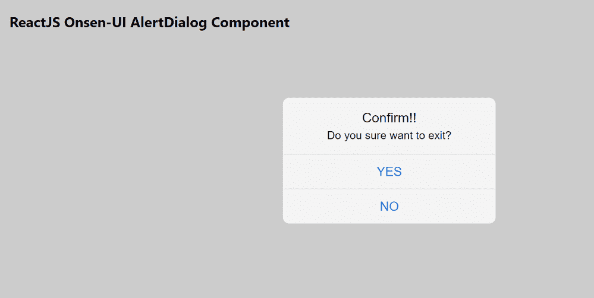

# 反应联森 UI 警报对话框组件

> 原文:[https://www . geesforgeks . org/reactjs-onsen-ui-alertdialog-component/](https://www.geeksforgeeks.org/reactjs-onsen-ui-alertdialog-component/)

ReactJS Onsen-UI 是一个受欢迎的前端库，具有一组 React 组件，旨在以一种美观高效的方式开发 HTML5 混合和移动网络应用程序。警报对话框组件允许用户在当前屏幕上显示和以及警报对话框。我们可以在 ReactJS 中使用以下方法来使用 Onsen-UI AlertDialog 组件。

**警报对话框命题:**

*   **onCancel:** 是一个回调函数，只有 isCancelable 为真时才会触发。
*   **isOpen:** 用于指示对话框是否打开并显示。
*   **可取消:**用于指定对话框是否可取消。
*   **isDisabled:** 用于指定对话框是否禁用。
*   **动画:**用于表示显示和隐藏对话框时使用的动画。
*   **修饰符:**用于表示对话框的外观。
*   **maskccolor:**用于表示背景遮罩的颜色。
*   **动画选项:**用于指定动画的持续时间、延迟和定时。
*   **onreshow:**这是一个回调函数，在警报对话框显示之前触发。
*   **onPostShow:** 是一个回调函数，在显示告警对话框后立即触发。
*   **onPreHide:** 是一个回调函数，在警报对话框隐藏之前触发。
*   **onpostshide:**是告警对话框隐藏后刚触发的回调函数。
*   **onDeviceBackButton:** 是设备后退按钮的自定义处理程序。

**预设修改器:**

*   **材质:**用于显示材质设计按钮。
*   **行页脚:**用于水平对齐页脚按钮。

**创建反应应用程序并安装模块:**

*   **步骤 1:** 使用以下命令创建一个反应应用程序:

    ```jsx
    npx create-react-app foldername
    ```

*   **步骤 2:** 在创建项目文件夹(即文件夹名**)后，使用以下命令将**移动到该文件夹:

    ```jsx
    cd foldername
    ```

*   **步骤 3:** 创建 ReactJS 应用程序后，使用以下命令安装所需的****模块:****

    ```jsx
    **npm install onsenui react-onsenui** 
    ```

******项目结构:**如下图。****

****

项目结构**** 

******示例:**现在在 **App.js** 文件中写下以下代码。在这里，App 是我们编写代码的默认组件。****

## ****App.js****

```jsx
**import React from 'react';
import 'onsenui/css/onsen-css-components.css';
import { AlertDialog, Button } from 'react-onsenui';

export default function App() {
    return (
        <div style={{
            display: 'block', width: 500, paddingLeft: 30
        }}>
            <h6>ReactJS Onsen-UI AlertDialog Component</h6>
            <AlertDialog isOpen={true}>
                <div className="alert-dialog-title">
                   Confirm!!
                </div>
                <div className="alert-dialog-content">
                    Do you sure want to exit?
                </div>
                <div className="alert-dialog-footer">
                    <Button className="alert-dialog-button">
                       YES
                    </Button>
                    <Button className="alert-dialog-button">
                       NO
                    </Button>
                </div>
            </AlertDialog>
        </div>
    );
}**
```

******运行应用程序的步骤:**从项目的根目录使用以下命令运行应用程序:****

```jsx
**npm start**
```

******输出:**现在打开浏览器，转到***http://localhost:3000/***，会看到如下输出:****

********

******参考:**[https://onsen . io/v2/API/reac/alert dialog . html](https://onsen.io/v2/api/react/AlertDialog.html)****