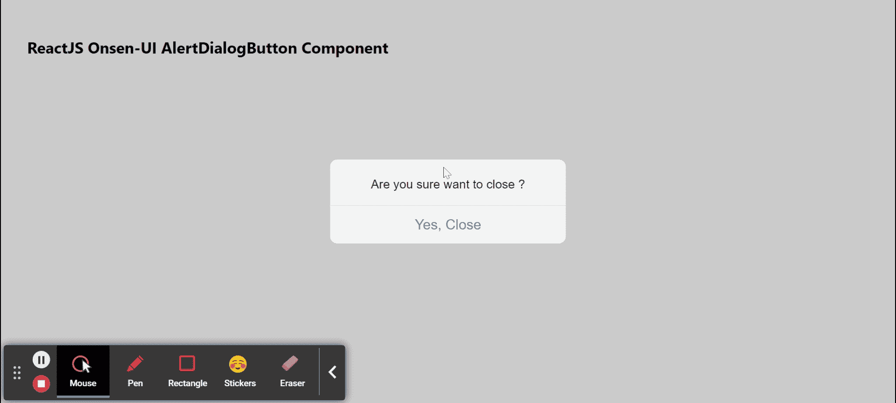

# 反应联顺 UI 报警对话按钮元件

> 原文:[https://www . geeksforgeeks . org/reactjs-onsen-ui-alertdialogbutton-component/](https://www.geeksforgeeks.org/reactjs-onsen-ui-alertdialogbutton-component/)

ReactJS Onsen-UI 是一个受欢迎的前端库，具有一组 React 组件，旨在以一种美观高效的方式开发 HTML5 混合和移动网络应用程序。报警对话框的每个按钮都由报警对话框的组件表示。  我们可以在 ReactJS 中使用以下方法来使用 Onsen-UI AlertDialogButton 组件。

**警报对话按钮提议:**

*   **修饰符:**用于表示报警对话框按钮的外观。
*   **禁用:**用于指定按钮是否禁用。
*   **onClick:** 是点击按钮时触发的回调函数。

**预设修改器:**

*   **物料:**用于显示物料设计预警-对话框按钮。

**创建反应应用程序并安装模块:**

*   **步骤 1:** 使用以下命令创建一个反应应用程序:

    ```
    npx create-react-app foldername
    ```

*   **步骤 2:** 在创建项目文件夹(即文件夹名**)后，使用以下命令将**移动到该文件夹:

    ```
    cd foldername
    ```

*   **步骤 3:** 创建 ReactJS 应用程序后，使用以下命令安装所需的****模块:****

    ```
    **npm install onsenui react-onsenui** 
    ```

******项目结构:**如下图。****

****

项目结构**** 

******示例:**现在在 **App.js** 文件中写下以下代码。在这里，App 是我们编写代码的默认组件。****

## ****App.js****

```
**import React from 'react';
import 'onsenui/css/onsen-css-components.css';
import { AlertDialog, AlertDialogButton } from 'react-onsenui';

export default function App() {

    // State for modal open-close
    const [close, setClose] = React.useState(true)

    return (
        <div style={{
            display: 'block', width: 500, paddingLeft: 30
        }}>
            <h6>ReactJS Onsen-UI AlertDialogButton Component</h6>
            <AlertDialog isOpen={close}>
                <div className="alert-dialog-content">
                    Are you sure want to close ?
                </div>
                <div className="alert-dialog-footer">
                    <AlertDialogButton className="alert-dialog-button"
                        onClick={() => { setClose(false) }}
                    >
                        Yes, Close
                    </AlertDialogButton>
                </div>
            </AlertDialog>
        </div>
    );
}**
```

******运行应用程序的步骤:**从项目的根目录使用以下命令运行应用程序:****

```
**npm start**
```

******输出:**现在打开浏览器，转到***http://localhost:3000/***，会看到如下输出:****

********

******参考:**[https://onsen . io/v2/API/reac/alert dialog button . html](https://onsen.io/v2/api/react/AlertDialogButton.html)****