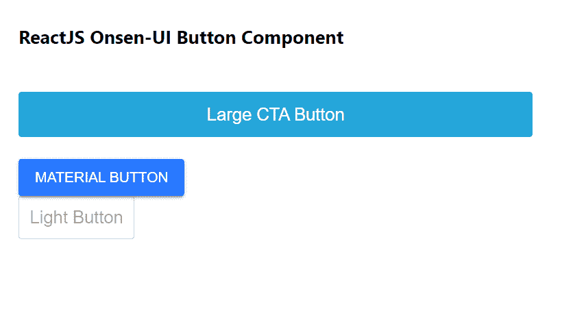

# 重新获取 Onsen 用户界面按钮组件

> 原文:[https://www . geesforgeks . org/reactjs-onsen-ui-button-component/](https://www.geeksforgeeks.org/reactjs-onsen-ui-button-component/)

ReactJS Onsen-UI 是一个流行的前端库，具有一组 React 组件，旨在美丽高效地开发 HTML5 混合和移动网络应用程序。按钮组件允许用户通过一次点击来采取行动和做出选择。我们可以在 ReactJS 中使用以下方法来使用 Onsen-UI 按钮组件。

**按钮道具:**

*   **修饰词:**用于按钮的外观。
*   **禁用:**用于指定按钮是否禁用。
*   **波纹:**用于指定按钮是否有波纹效果。
*   **onClick:** 是点击按钮时触发的回调函数。

**预设修改器:**

*   **轮廓:**用于显示具有轮廓和透明背景的按钮。
*   **灯:**用于显示不突出的按钮。
*   **安静:**用于显示没有轮廓和/或背景的按钮。
*   **cta:** 用来展示一个真正突出的按钮。
*   **大号大号:**用于显示覆盖屏幕宽度的按钮。
*   **大–静音:**用于显示大静音按钮。
*   **大–CTA:**用于显示大的行动号召按钮。
*   **材质:**用于显示材质设计按钮。
*   **材质–扁平:**用于显示材质设计扁平按钮。

**创建反应应用程序并安装模块:**

*   **步骤 1:** 使用以下命令创建一个反应应用程序:

    ```
    npx create-react-app foldername
    ```

*   **步骤 2:** 在创建项目文件夹(即文件夹名**)后，使用以下命令将**移动到该文件夹:

    ```
    cd foldername
    ```

*   **步骤 3:** 创建 ReactJS 应用程序后，使用以下命令安装所需的****模块:****

    ```
    **npm install onsenui react-onsenui** 
    ```

******项目结构:**如下图。****

****

项目结构**** 

******示例:**现在在 **App.js** 文件中写下以下代码。在这里，App 是我们编写代码的默认组件。****

## ****App.js****

```
**import React from 'react';
import 'onsenui/css/onsen-css-components.css';
import { Button } from 'react-onsenui';

export default function App() {

  return (
    <div style={{
      display: 'block', width: 500, paddingLeft: 30
    }}>
      <h6>ReactJS Onsen-UI Button Component</h6>
      <Button modifier="large--cta">
        Large CTA Button
      </Button> <br></br>
      <Button modifier="material">
        Material Button
      </Button> <br></br>
      <Button modifier="light">
        Light Button
      </Button>
    </div>
  );
}**
```

******运行应用程序的步骤:**从项目的根目录使用以下命令运行应用程序:****

```
**npm start**
```

******输出:**现在打开浏览器，转到***http://localhost:3000/***，会看到如下输出:****

********

******参考:**T2】https://onsen.io/v2/api/react/Button.html****