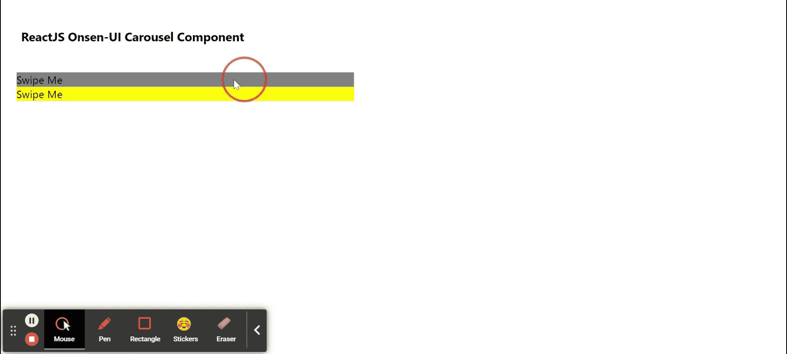

# 重新获取 Onsen 用户界面转盘组件

> 原文:[https://www . geeksforgeeks . org/reactjs-onsen-ui-carousel-component/](https://www.geeksforgeeks.org/reactjs-onsen-ui-carousel-component/)

ReactJS Onsen-UI 是一个受欢迎的前端库，具有一组 React 组件，旨在以一种美观高效的方式开发 HTML5 混合和移动网络应用程序。轮播组件允许用户展示滑动项，当同一层级有一组内容时使用。我们可以在 ReactJS 中使用以下方法来使用 Onsen-UI 轮播组件。

**转盘道具:**

*   **方向:**用于表示转盘的方向。
*   **全屏:**当设置为真时，转盘将覆盖整个屏幕。
*   **超滚动:**旋转木马会在边缘滚动，当设置为真时，它会在释放时弹回。
*   **居中:**当设置为真时，转盘所选项目将位于转盘的中心，而不是开始位置。
*   **物品宽度:**用于表示 on-carousel-item 的宽度。
*   **物品高度:**用于表示 on-carousel-item 的高度。
*   **自动滚动:**当设置为真时，旋转木马在释放时会自动滚动到最近的项目边框。
*   **自动滚动比率:**它指定用户必须拖动转盘多少才能自动滚动到下一个项目，范围从 0 到 1。
*   **可滚动:**当设置为真时，可以通过拖动或滑动滚动转盘。
*   **禁用:**当设置为真时，转盘将被禁用。
*   **索引:**用于指定要显示的 ons-carousel-item 的索引。
*   **自动刷新:**当设置为真时，当子节点数量发生变化时，转盘将自动刷新。
*   **onPostChange:** 它是一个回调函数，在当前轮播项目刚刚更改后调用。
*   **onRefresh:** 它是一个回调函数，在轮播刷新后调用。
*   **onOverscroll:** 这是一个回调函数，当转盘被超滚动时调用。
*   **动画选项:**用于指定动画的持续时间、延迟和定时。
*   **on sweep:**这是一个回调函数，每当用户滑动转盘时都会调用。

**创建反应应用程序并安装模块:**

*   **步骤 1:** 使用以下命令创建一个反应应用程序:

    ```
    npx create-react-app foldername
    ```

*   **步骤 2:** 创建项目文件夹(即文件夹名**)后，使用以下命令移动到该文件夹中:**

    ```
    cd foldername
    ```

*   **步骤 3:** 创建 ReactJS 应用程序后，使用以下命令安装所需的****模块:****

    ```
    **npm install onsenui react-onsenui** 
    ```

******项目结构:**如下图。****

****

项目结构**** 

******示例:**现在在 **App.js** 文件中写下以下代码。在这里，App 是我们编写代码的默认组件。****

## ****App.js****

```
**import React from 'react';
import 'onsenui/css/onsen-css-components.css';
import { Carousel, CarouselItem } from 'react-onsenui';

export default function App() {

    return (
        <div style={{
            display: 'block', width: 500, paddingLeft: 30
        }}>
            <h6>ReactJS Onsen-UI Carousel Component</h6>
            <Carousel swipeable
                overscrollable
                fullscreen
            >
                <CarouselItem>
                    <div style={{ backgroundColor: 'gray' }}>
                      Swipe Me
                    </div>
                </CarouselItem>
                <CarouselItem>
                    <div style={{ backgroundColor: 'yellow' }}>
                      Swipe Me
                    </div>
                </CarouselItem>
            </Carousel>
        </div>
    );
}**
```

******运行应用程序的步骤:**从项目的根目录使用以下命令运行应用程序:****

```
**npm start**
```

******输出:**现在打开浏览器，转到***http://localhost:3000/***，会看到如下输出:****

********

******参考:**T2】https://onsen.io/v2/api/react/Carousel.html****