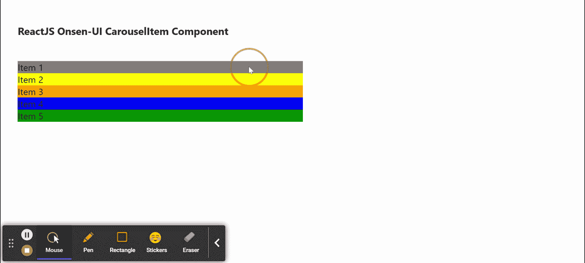

# 重新获取 Onsen UI 旋转木马组件

> 原文:[https://www . geeksforgeeks . org/reactjs-onsen-ui-carousel item-component/](https://www.geeksforgeeks.org/reactjs-onsen-ui-carouselitem-component/)

ReactJS Onsen-UI 是一个受欢迎的前端库，具有一组 React 组件，旨在以一种美观高效的方式开发 HTML5 混合和移动网络应用程序。转盘项目组件允许用户将转盘项目添加到转盘组件。我们可以在 ReactJS 中使用下面的方法来使用 Onsen-UI carouselet 组件。

**旋转木马道具:**

*   **修改器**:用于指定修改器名称，以指定自定义样式。

**创建反应应用程序并安装模块:**

*   **步骤 1:** 使用以下命令创建一个反应应用程序:

    ```
    npx create-react-app foldername
    ```

*   **步骤 2:** 在创建项目文件夹(即文件夹名**)后，使用以下命令将**移动到该文件夹:

    ```
    cd foldername
    ```

*   **步骤 3:** 创建 ReactJS 应用程序后，使用以下命令安装所需的****模块:****

    ```
    **npm install onsenui react-onsenui** 
    ```

******项目结构:**如下图。****

****

项目结构**** 

******示例:**现在在 **App.js** 文件中写下以下代码。在这里，App 是我们编写代码的默认组件。****

## ****App.js****

```
**import React from 'react';
import 'onsenui/css/onsen-css-components.css';
import { Carousel, CarouselItem } from 'react-onsenui';

export default function App() {

    return (
        <div style={{
            display: 'block', width: 500, paddingLeft: 30
        }}>
            <h6>ReactJS Onsen-UI CarouselItem Component</h6>
            <Carousel swipeable
                overscrollable
                fullscreen
            >
                <CarouselItem>
                    <div style={{ backgroundColor: 'gray' }}>
                     Item 1
                    </div>
                </CarouselItem>
                <CarouselItem>
                    <div style={{ backgroundColor: 'yellow' }}>
                      Item 2
                    </div>
                </CarouselItem>
                <CarouselItem>
                    <div style={{ backgroundColor: 'orange' }}>
                      Item 3
                    </div>
                </CarouselItem>
                <CarouselItem>
                    <div style={{ backgroundColor: 'blue' }}>
                      Item 4
                    </div>
                </CarouselItem>
                <CarouselItem>
                    <div style={{ backgroundColor: 'green' }}>
                      Item 5
                    </div>
                </CarouselItem>
            </Carousel>
        </div>
    );
}**
```

******运行应用程序的步骤:**从项目的根目录使用以下命令运行应用程序:****

```
**npm start**
```

******输出:**现在打开浏览器，转到***http://localhost:3000/***，会看到如下输出:****

********

******参考:**T2】https://onsen.io/v2/api/react/CarouselItem.html****