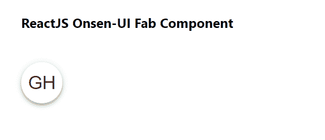

# 重新获取 Onsen UI Fab 组件

> 原文:[https://www . geeksforgeeks . org/reactjs-onsen-ui-fab-component/](https://www.geeksforgeeks.org/reactjs-onsen-ui-fab-component/)

ReactJS Onsen-UI 是一个受欢迎的前端库，具有一组 React 组件，旨在以一种美观高效的方式开发 HTML5 混合和移动网络应用程序。Fab 组件允许用户提供一个浮动动作按钮，它是一个圆形按钮。我们可以在 ReactJS 中使用以下方法来使用 Onsen-UI Fab 组件。

**晶圆厂道具:**

*   **修饰词:**用于按钮的外观。
*   **波纹:**如果设置为真，点击按钮会有波纹效果。
*   **位置:**用于按钮的位置。
*   **禁用:**用于禁用按钮。
*   **onClick:** 是一个按钮一旦被点击就会被调用的函数。

**预设修改器:**

*   **mini:** 用于使*on-fab*更小。

**创建反应应用程序并安装模块:**

*   **步骤 1:** 使用以下命令创建一个反应应用程序:

    ```jsx
    npx create-react-app foldername
    ```

*   **步骤 2:** 在创建项目文件夹(即文件夹名**)后，使用以下命令将**移动到该文件夹:

    ```jsx
    cd foldername
    ```

*   **步骤 3:** 创建 ReactJS 应用程序后，使用以下命令安装所需的****模块:****

    ```jsx
    **npm install onsenui react-onsenui** 
    ```

******项目结构:**如下图。****

****

项目结构**** 

******示例:**现在在 **App.js** 文件中写下以下代码。在这里，App 是我们编写代码的默认组件。****

## ****App.js****

```jsx
**import React from 'react';
import 'onsenui/css/onsen-css-components.css';
import { Fab } from 'react-onsenui';

export default function App() {

  return (
    <div style={{
      display: 'block', width: 500, paddingLeft: 30
    }}>
      <h6>ReactJS Onsen-UI Fab Component</h6>
      <Fab modifier="material" 
         onClick={() => { alert('Clicked!') }}>GH</Fab>
    </div>
  );
}**
```

******运行应用程序的步骤:**从项目的根目录使用以下命令运行应用程序:****

```jsx
**npm start**
```

******输出:**现在打开浏览器，转到***http://localhost:3000/***，会看到如下输出:****

********

******参考:**[https://onsen . io/v2/API/reac/fab . html](https://onsen.io/v2/api/react/Fab.html)****