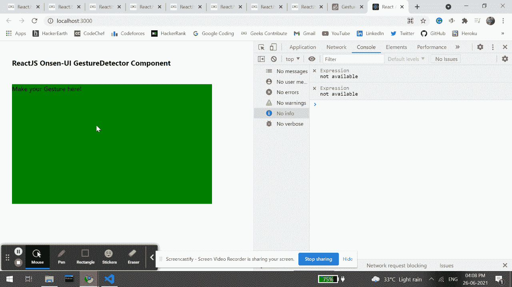

# 重新连接 Onsen UI 手势检测器组件

> 原文:[https://www . geesforgeks . org/reactjs-onsen-ui-gesturedetector-component/](https://www.geeksforgeeks.org/reactjs-onsen-ui-gesturedetector-component/)

ReactJS Onsen-UI 是一个受欢迎的前端库，具有一组 React 组件，旨在以一种美观高效的方式开发 HTML5 混合和移动网络应用程序。手势检测器组件允许用户检测包装元素内的手指手势。我们可以在 ReactJS 中使用以下方法来使用 Onsen-UI 手势检测器组件。

**手势探测器道具:**

*   **onDrag:** 是用户向任意方向拖动时调用的回调函数。
*   **onDragLeft:** 是用户向左拖动时调用的回调函数。
*   **onDragRight:** 是用户向右拖动时调用的回调函数。
*   **onDragUp:** 是用户向上拖动时调用的回调函数。
*   **onDragDown:** 是用户下拉时调用的回调函数。
*   **onHold:** 是用户按住时调用的回调函数。
*   **onRelease:** 是用户释放时调用的回调函数。
*   **on sweep:**是一个回调函数，当用户向任意方向刷卡时调用。
*   **onswipleft:**是用户左刷时调用的回调函数。
*   **onSwipeRight:** 是用户右扫时调用的回调函数。
*   **onSwipeUp:** 是用户刷机时调用的回调函数。
*   **onSwipeDown:** 是用户向下滑动时调用的回调函数。
*   **onTap:** 是用户点击时调用的回调函数。
*   **onDoubleTap:** 是用户双击时调用的回调函数。
*   **onPinch:** 是用户捏入或捏出时调用的回调函数。
*   **onPinchIn:** 是一个回调函数，当用户捏入时调用。
*   **onPinchOut:** 是用户捏出时调用的回调函数。
*   **onTouch:** 是用户触摸时调用的回调函数。
*   **onTransform:** 是用户转换时调用的回调函数。
*   **onRotate:** 是用户旋转时调用的回调函数。

**创建反应应用程序并安装模块:**

*   **步骤 1:** 使用以下命令创建一个反应应用程序:

    ```jsx
    npx create-react-app foldername
    ```

*   **步骤 2:** 创建项目文件夹(即文件夹名**)后，使用以下命令移动到该文件夹中:**

    ```jsx
    cd foldername
    ```

*   **步骤 3:** 创建 ReactJS 应用程序后，使用以下命令安装所需的****模块:****

    ```jsx
    **npm install onsenui react-onsenui** 
    ```

******项目结构:**如下图。****

****

项目结构**** 

******示例:**现在在 **App.js** 文件中写下以下代码。在这里，App 是我们编写代码的默认组件。****

## ****App.js****

```jsx
**import React from 'react';
import 'onsenui/css/onsen-css-components.css';
import { GestureDetector } from 'react-onsenui';

export default function App() {

    return (
        <div style={{
            display: 'block', width: 500, paddingLeft: 30
        }}>
            <h6>ReactJS Onsen-UI GestureDetector Component</h6>
            <GestureDetector
                onTap={() => console.log('You just tapped!!')}
                onDragRight={() => console.log('You just dragged Right!!')}
            >
                <div style={{ backgroundColor: 'green', 
                width: '500px', height: '300px' }}>
                    Make your Gesture here!
                </div>
            </GestureDetector>
        </div>
    );
}**
```

******运行应用程序的步骤:**从项目的根目录使用以下命令运行应用程序:****

```jsx
**npm start**
```

******输出:**现在打开浏览器，转到***http://localhost:3000/***，会看到如下输出:****

********

******参考:**T2】https://onsen.io/v2/api/react/GestureDetector.html****