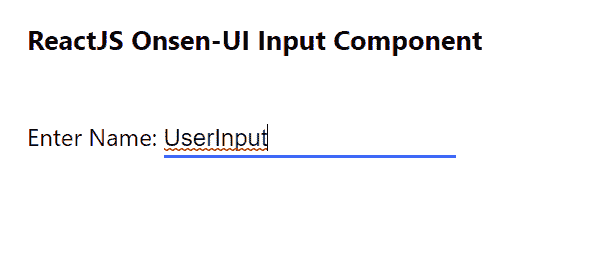

# 重新获取 Onsen 用户界面输入组件

> 原文:[https://www . geeksforgeeks . org/reactjs-onsen-ui-input-component/](https://www.geeksforgeeks.org/reactjs-onsen-ui-input-component/)

ReactJS Onsen-UI 是一个受欢迎的前端库，具有一组 React 组件，旨在以一种美观高效的方式开发 HTML5 混合和移动网络应用程序。输入组件允许用户创建一个基本的小部件，获取用户输入的是一个文本字段。我们可以在 ReactJS 中使用以下方法来使用 Onsen-UI 输入组件。

**输入道具:**

*   **修饰符:**用于输入的外观。
*   **禁用:**用于指定输入是否禁用。
*   **readOnly:** 用于指定输入是否为只读。
*   **onChange :** 是输入发生变化时触发的回调函数。
*   **值:**用于表示输入(受控)的内容。
*   **默认值:**用于表示第一次渲染时输入的内容(不受控制)。
*   **占位符:**用于表示占位符文本。
*   **类型:**用于指定输入类型。
*   **输入:**用于指定内部<输入>元素的“Id”属性。
*   **浮动:**如果存在该属性，占位符将在材质设计中被激活。

**预设修改器:**

*   **材料:**用于显示材料设计输入。
*   **下栏:**用于显示文本输入下方的水平线。
*   **透明:**用于显示透明输入。

**创建反应应用程序并安装模块:**

*   **步骤 1:** 使用以下命令创建一个反应应用程序:

    ```
    npx create-react-app foldername
    ```

*   **步骤 2:** 在创建项目文件夹(即文件夹名**)后，使用以下命令将**移动到该文件夹:

    ```
    cd foldername
    ```

*   **步骤 3:** 创建 ReactJS 应用程序后，使用以下命令安装所需的****模块:****

    ```
    **npm install onsenui react-onsenui** 
    ```

******项目结构:**如下图。****

****

项目结构**** 

******示例:**现在在 **App.js** 文件中写下以下代码。在这里，App 是我们编写代码的默认组件。****

## ****App.js****

```
**import React from 'react';
import 'onsenui/css/onsen-css-components.css';
import { Input } from 'react-onsenui';

export default function App() {

  return (
    <div style={{
      display: 'block', width: 500, paddingLeft: 30
    }}>
      <h6>ReactJS Onsen-UI Input Component</h6>
      Enter Name:
      <Input
        float
        onChange={(e) => { console.log(e) }}
        modifier='material'
      />
    </div>
  );
}**
```

******运行应用程序的步骤:**从项目的根目录使用以下命令运行应用程序:****

```
**npm start**
```

******输出:**现在打开浏览器，转到***http://localhost:3000/***，会看到如下输出:****

********

******参考:**T2】https://onsen.io/v2/api/react/Input.html****