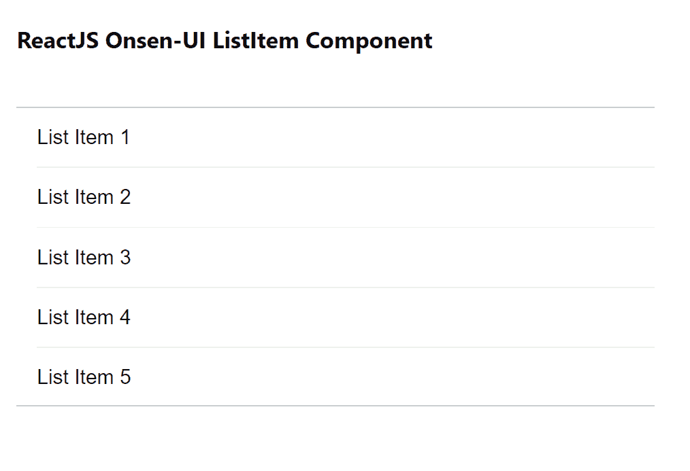

# 重新获取 Onsen 用户界面列表项组件

> 原文:[https://www . geesforgeks . org/reactjs-onsen-ui-listitem-component/](https://www.geeksforgeeks.org/reactjs-onsen-ui-listitem-component/)

ReactJS Onsen-UI 是一个受欢迎的前端库，具有一组 React 组件，旨在以一种美观高效的方式开发 HTML5 混合和移动网络应用程序。列表项组件代表列表中的每个项目。是用定义列表项。我们可以在 ReactJS 中使用以下方法来使用 Onsen-UI 列表项组件。

**上市命题:**

*   **修饰语:**用于表示列表项的外观。
*   **可点击:**用于指定列表项是否可点击。
*   **tapBackgroundColor:** 用于点击时改变背景颜色。
*   **lockOnDrag:** 用于用户水平拖动时防止垂直滚动。
*   **可展开:**用于指定列表项是否可以展开以显示隐藏内容。
*   **展开:**用于指定可展开列表项是否展开。

**预设修改器:**

*   **可点击:**用于列表项被点击时改变外观。
*   **人字形:**用于在列表项的右端显示一个人字形，点击后外观会发生变化。
*   **longdivider:** 用于显示项目之间的长水平分隔线。
*   **nodivider:** 用于移除列表项之间的分隔线。
*   **材料:**用于显示材料设计列表项。

**创建反应应用程序并安装模块:**

*   **步骤 1:** 使用以下命令创建一个反应应用程序:

    ```
    npx create-react-app foldername
    ```

*   **步骤 2:** 创建项目文件夹(即文件夹名**)后，使用以下命令移动到该文件夹中:**

    ```
    cd foldername
    ```

*   **步骤 3:** 创建 ReactJS 应用程序后，使用以下命令安装所需的****模块:****

    ```
    **npm install onsenui react-onsenui** 
    ```

******项目结构:**如下图。****

****

项目结构**** 

******示例:**现在在 **App.js** 文件中写下以下代码。在这里，App 是我们编写代码的默认组件。****

## ****App.js****

```
**import React from 'react';
import 'onsenui/css/onsen-css-components.css';
import { List, ListItem } from 'react-onsenui';

export default function App() {

    // Sample List Item 
    const sampleListItem = ['List Item 1',
        'List Item 2', 'List Item 3', 'List Item 4', 'List Item 5']

    return (
        <div style={{
            display: 'block', width: 500, paddingLeft: 30
        }}>
            <h6>ReactJS Onsen-UI ListItem Component</h6>
            <List
                dataSource={sampleListItem}
                renderRow={(row) => (
                    <ListItem modifier={'material'}>
                        {row}
                    </ListItem>
                )}
            />
        </div>
    );
}**
```

******运行应用程序的步骤:**从项目的根目录使用以下命令运行应用程序:****

```
**npm start**
```

******输出:**现在打开浏览器，转到***http://localhost:3000/***，会看到如下输出:****

********

******参考:**[https://onsen . io/v2/API/reac/listitem . html](https://onsen.io/v2/api/react/ListItem.html)****