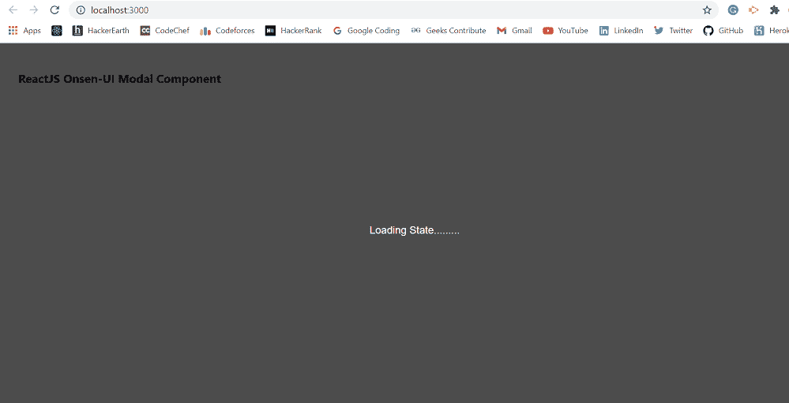

# 重新获取 Onsen UI 模态组件

> 原文:[https://www . geeksforgeeks . org/reactjs-onsen-ui-modal-component/](https://www.geeksforgeeks.org/reactjs-onsen-ui-modal-component/)

ReactJS Onsen-UI 是一个受欢迎的前端库，拥有一组 React 组件，旨在以美观高效的方式开发 HTML5 混合和移动网络应用。模态组件为创建对话框、灯箱、弹出窗口等提供了坚实的基础。我们可以在 ReactJS 中使用以下方法来使用 Onsen-UI 模态组件。

**模态道具:**

*   **动画:**用来表示动画名称像*淡化*、*提升*、*无。*
*   **动画选项:**用于指定动画的持续时间、延迟和定时。
*   **onreshow:**是一个回调函数，在显示模态之前触发。
*   **onPostShow:** 是一个回调函数，刚好在模态显示之后触发。
*   **onPreHide:** 是一个回调函数，就在模态隐藏之前被触发。
*   **onpostshide:**是一个回调函数，刚好在模态隐藏后被触发。
*   **isOpen:** 当设置为真时，模态会显示出来。
*   **onDeviceBackButton:** 用于设备后退按钮的自定义处理程序。

**预设修改器:**

*   **轮廓:**用于显示具有轮廓和透明背景的按钮。
*   **灯:**用于显示不突出的按钮。
*   **安静:**用于显示没有轮廓和/或背景的按钮。
*   **cta:** 用来展示一个真正突出的按钮。
*   **大号大号:**用于显示覆盖屏幕宽度的按钮。
*   **大–静音:**用于显示大静音按钮。
*   **大–CTA:**用于显示大的行动号召按钮。
*   **材质:**用于显示材质设计按钮。
*   **材质–扁平:**用于显示材质设计扁平按钮。

**创建反应应用程序并安装模块:**

**步骤 1:** 使用以下命令创建一个反应应用程序:

```jsx
npx create-react-app foldername
```

**步骤 2:** 创建项目文件夹(即文件夹名**)后，使用以下命令移动到该文件夹中:**

```jsx
cd foldername
```

**步骤 3:** 创建 ReactJS 应用程序后，使用以下命令安装所需的****模块:****

```jsx
**npm install onsenui react-onsenui** 
```

******项目结构:**如下图。****

****

项目结构**** 

******示例:**现在在 **App.js** 文件中写下以下代码。在这里，App 是我们编写代码的默认组件。****

## ****java 描述语言****

```jsx
**import React from 'react';
import 'onsenui/css/onsen-css-components.css';
import { Modal } from 'react-onsenui';

export default function App() {

  return (
    <div style={{
      display: 'block', width: 500, paddingLeft: 30
    }}>
      <h6>ReactJS Onsen-UI Modal Component</h6>
      <Modal isOpen={true}>
        Loading State.........
      </Modal>
    </div>
  );
}**
```

******运行应用程序的步骤:**从项目的根目录使用以下命令运行应用程序:****

```jsx
**npm start**
```

******输出:**现在打开浏览器，转到***http://localhost:3000/***，会看到如下输出:****

********

******参考:**T2】https://onsen.io/v2/api/react/Modal.html****