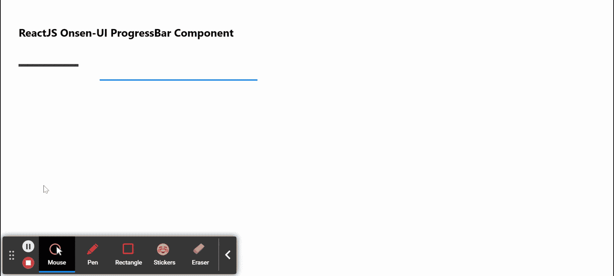

# 重新获取 Onsen UI 进度条组件

> 原文:[https://www . geesforgeks . org/reactjs-onsen-ui-progress bar-component/](https://www.geeksforgeeks.org/reactjs-onsen-ui-progressbar-component/)

ReactJS Onsen-UI 是一个受欢迎的前端库，具有一组 React 组件，旨在以一种美观高效的方式开发 HTML5 混合和移动网络应用程序。进度条组件为提供了一种以进度条的形式向用户显示任何任务/活动进度的方式。我们可以在 ReactJS 中使用以下方法来使用 Onsen-UI ProgressBar 组件。

**ProgressBar Props:**

*   **修改器:**用于进度条的外观。
*   **值:**用于表示当前进度的值。
*   **次要值:**用于表示当前次要进度的值。
*   **中间:**如果设置为真，用于显示无限循环动画。

**预设修改器:**

*   **材质:**用于显示材质设计进度条。

**创建反应应用程序并安装模块:**

*   **步骤 1:** 使用以下命令创建一个反应应用程序:

    ```
    npx create-react-app foldername
    ```

*   **步骤 2:** 创建项目文件夹(即文件夹名**)后，使用以下命令移动到该文件夹中:**

    ```
    cd foldername
    ```

*   **步骤 3:** 创建 ReactJS 应用程序后，使用以下命令安装所需的****模块:****

    ```
    **npm install onsenui react-onsenui** 
    ```

******项目结构:**如下图。****

****

项目结构**** 

******示例:**现在在 **App.js** 文件中写下以下代码。在这里，App 是我们编写代码的默认组件。****

## ****App.js****

```
**import React from 'react';
import 'onsenui/css/onsen-css-components.css';
import 'onsenui/css/onsenui.css';
import { ProgressBar } from 'react-onsenui';

export default function App() {

  return (
    <div style={{
      display: 'block', width: 500, paddingLeft: 30
    }}>
      <h6>ReactJS Onsen-UI ProgressBar Component</h6>
      <ProgressBar modifier="material" value={20} /> <br></br>
      <ProgressBar indeterminate />
    </div>
  );
}**
```

******运行应用程序的步骤:**从项目的根目录使用以下命令运行应用程序:****

```
**npm start**
```

******输出:**现在打开浏览器，转到***http://localhost:3000/***，会看到如下输出:****

********

******参考:**[https://onsen . io/v2/API/reac/progress bar . html](https://onsen.io/v2/api/react/ProgressBar.html)****