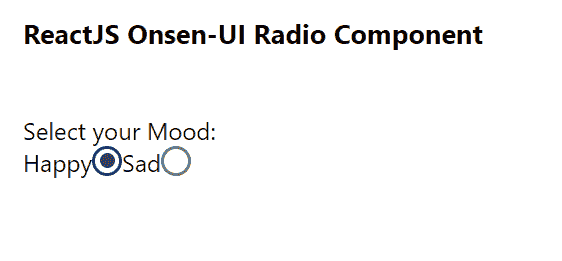

# 重新连接 Onsen UI 无线电组件

> 原文:[https://www . geesforgeks . org/reactjs-onsen-ui-radio-component/](https://www.geeksforgeeks.org/reactjs-onsen-ui-radio-component/)

ReactJS Onsen-UI 是一个受欢迎的前端库，具有一组 React 组件，旨在以一种美观高效的方式开发 HTML5 混合和移动网络应用程序。单选组件允许用户 从一组 中选择一个选项。我们可以在 ReactJS 中使用以下方法来使用 Onsen-UI 无线电组件。

**无线电道具:**

*   **修饰语:**用于收音机的外观。
*   **禁用:**用于指定收音机是否禁用。
*   **onChange :** 是单选按钮状态改变时触发的回调函数。
*   **值:**用于表示单选按钮的值。
*   **勾选:**用于控制单选按钮(受控)的状态。
*   **defaultCkecked:** 用于定义未控制输入首次渲染时单选按钮的状态。
*   **输入:**用于指定内部<输入>元素的“Id”属性。

**预设修改器:**

*   **材质:**用于显示材质设计单选按钮。

**创建反应应用程序并安装模块:**

*   **步骤 1:** 使用以下命令创建一个反应应用程序:

    ```
    npx create-react-app foldername
    ```

*   **步骤 2:** 在创建项目文件夹(即文件夹名**)后，使用以下命令将**移动到该文件夹:

    ```
    cd foldername
    ```

*   **步骤 3:** 创建 ReactJS 应用程序后，使用以下命令安装所需的****模块:****

    ```
    **npm install onsenui react-onsenui** 
    ```

******项目结构:**如下图。****

****

项目结构**** 

******示例:**现在在 **App.js** 文件中写下以下代码。在这里，App 是我们编写代码的默认组件。****

## ****App.js****

```
**import React from 'react';
import 'onsenui/css/onsen-css-components.css';
import { Radio } from 'react-onsenui';

export default function App() {

  return (
    <div style={{
      display: 'block', width: 500, paddingLeft: 30
    }}>
      <h6>ReactJS Onsen-UI Radio Component</h6>
      Select your Mood: <br></br>
      Happy
      <Radio
        name="mood"
        onChange={(e) => { console.log(e) }}
        modifier='material'
      />
      Sad
      <Radio
        name="mood"
        onChange={(e) => { console.log(e) }}
        modifier='material'
      />
    </div>
  );
}**
```

******运行应用程序的步骤:**从项目的根目录使用以下命令运行应用程序:****

```
**npm start**
```

******输出:**现在打开浏览器，转到***http://localhost:3000/***，会看到如下输出:****

********

******参考:**[https://onsen . io/v2/API/reac/radio . html](https://onsen.io/v2/api/react/Radio.html)****