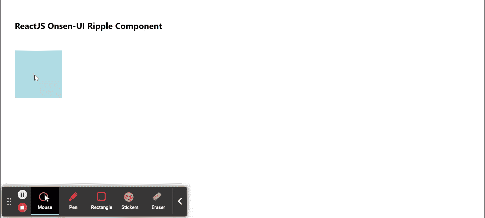

# 重新获取 Onsen UI 波纹组件

> 原文:[https://www . geeksforgeeks . org/reactjs-onsen-ui-ripple-component/](https://www.geeksforgeeks.org/reactjs-onsen-ui-ripple-component/)

ReactJS Onsen-UI 是一个受欢迎的前端库，具有一组 React 组件，旨在以一种美观高效的方式开发 HTML5 混合和移动网络应用程序。波纹组件用于 为元素添加材质设计*波纹*效果。  我们可以在 ReactJS 中使用以下方法来使用 Onsen-UI 波纹组件。

**涟漪道具:**

*   **颜色:**用于指定涟漪效果的颜色。
*   **背景:**用于指定背景的颜色。
*   **禁用:**用于指定按钮是否禁用。

**预设修改器:**

*   **浅灰色:**用于将效果颜色改为浅灰色。

**创建反应应用程序并安装模块:**

*   **步骤 1:** 使用以下命令创建一个反应应用程序:

    ```jsx
    npx create-react-app foldername
    ```

*   **步骤 2:** 创建项目文件夹(即文件夹名**)后，使用以下命令移动到该文件夹中:**

    ```jsx
    cd foldername
    ```

*   **步骤 3:** 创建 ReactJS 应用程序后，使用以下命令安装所需的****模块:****

    ```jsx
    **npm install onsenui react-onsenui** 
    ```

******项目结构:**如下图。****

****

项目结构**** 

******示例:**现在在 **App.js** 文件中写下以下代码。在这里，App 是我们编写代码的默认组件。****

## ****App.js****

```jsx
**import React from 'react';
import 'onsenui/css/onsen-css-components.css';
import 'onsenui/css/onsenui.css';
import { Ripple } from 'react-onsenui';

export default function App() {

  return (
    <div style={{
      display: 'block', width: 500, paddingLeft: 30
    }}>
      <h6>ReactJS Onsen-UI Ripple Component</h6>
      <div style={{ width: 100, height: 100, backgroundColor: 'lightblue' }}>
        <Ripple color='red' />
      </div>
    </div>
  );
}**
```

******运行应用程序的步骤:**从项目的根目录使用以下命令运行应用程序:****

```jsx
**npm start**
```

******输出:**现在打开浏览器，转到***http://localhost:3000/***，会看到如下输出:****

********

******参考:**T2】https://onsen.io/v2/api/react/Ripple.html****