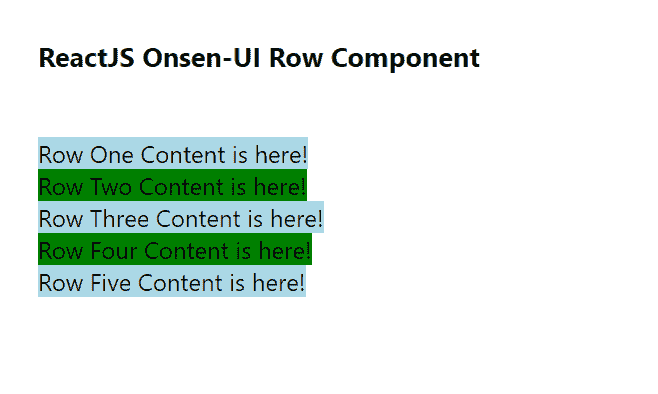

# 重新获取 Onsen UI 行组件

> 原文:[https://www . geeksforgeeks . org/reactjs-onsen-ui-row-component/](https://www.geeksforgeeks.org/reactjs-onsen-ui-row-component/)

ReactJS Onsen-UI 是一个流行的前端库，具有一组 React 组件，旨在美丽高效地开发 HTML5 混合和移动网络应用程序。Row 组件提供了一种在网格系统中表示一行的方式，用于以行的形式显示数据。我们可以在 ReactJS 中使用以下方法来使用 Onsen-UI 行组件。

**排道具:**

*   **垂直对齐:**是垂直对齐的短手属性。

**创建反应应用程序并安装模块:**

**步骤 1:** 使用以下命令创建一个反应应用程序:

```
npx create-react-app foldername
```

**步骤 2:** 创建项目文件夹(即文件夹名**)后，使用以下命令移动到该文件夹中:**

```
cd foldername
```

**步骤 3:** 创建 ReactJS 应用程序后，使用以下命令安装所需的****模块:****

```
**npm install onsenui react-onsenui** 
```

******项目结构:**如下图。****

****

项目结构**** 

******示例:**现在在 **App.js** 文件中写下以下代码。在这里，App 是我们编写代码的默认组件。****

## ****java 描述语言****

```
**import React from 'react';
import 'onsenui/css/onsen-css-components.css';
import { Row } from 'react-onsenui';

export default function App() {

  return (
    <div style={{
      display: 'block', width: 500, paddingLeft: 30
    }}>
      <h6>ReactJS Onsen-UI Row Component</h6>
      <Row style={{ backgroundColor: 'lightblue' }}>
      Row One Content is here!</Row> <br></br>
      <Row style={{ backgroundColor: 'green' }}>
      Row Two Content is here!</Row> <br></br>
      <Row style={{ backgroundColor: 'lightblue' }}>
      Row Three Content is here!</Row> <br></br>
      <Row style={{ backgroundColor: 'green' }}>
      Row Four Content is here!</Row> <br></br>
      <Row style={{ backgroundColor: 'lightblue' }}>
      Row Five Content is here!</Row> <br></br>
    </div>
  );
}**
```

******运行应用程序的步骤:**从项目的根目录使用以下命令运行应用程序:****

```
**npm start**
```

******输出:**现在打开浏览器，转到***http://localhost:3000/***，会看到如下输出:****

********

******参考:**T2】https://onsen.io/v2/api/react/Row.html#main****