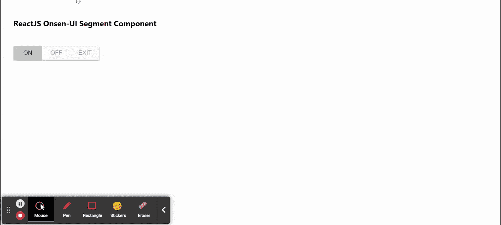

# 重新获取 Onsen 用户界面部分组件

> 原文:[https://www . geeksforgeeks . org/reactjs-onsen-ui-segment-component/](https://www.geeksforgeeks.org/reactjs-onsen-ui-segment-component/)

ReactJS Onsen-UI 是一个受欢迎的前端库，具有一组 React 组件，旨在以一种美观高效的方式开发 HTML5 混合和移动网络应用程序。段组件允许用户在不同数量的连续选项之间切换。我们可以在 ReactJS 中使用以下方法来使用 Onsen-UI 细分组件。

**段位道具:**

*   **索引:**用于表示要高亮显示的按钮的索引。
*   **tabbarId:** 用于表示< Tabbar >的 Id，以“连接”到该段。
*   **修改器:**用于线段的外观。
*   **onPostChange:** 是活动按钮改变后触发的回调函数。

**预设修改器:**

*   **材料:**用于材料设计段。

**创建反应应用程序并安装模块:**

*   **步骤 1:** 使用以下命令创建一个反应应用程序:

    ```
    npx create-react-app foldername
    ```

*   **步骤 2:** 创建项目文件夹(即文件夹名**)后，使用以下命令移动到该文件夹中:**

    ```
    cd foldername
    ```

*   **步骤 3:** 创建 ReactJS 应用程序后，使用以下命令安装所需的****模块:****

    ```
    **npm install onsenui react-onsenui** 
    ```

******项目结构:**如下图。****

****

项目结构**** 

******示例:**现在在 **App.js** 文件中写下以下代码。在这里，App 是我们编写代码的默认组件。****

## ****App.js****

```
**import React from 'react';
import 'onsenui/css/onsen-css-components.css';
import { Segment, Button } from 'react-onsenui';

export default function App() {

  return (
    <div style={{
      display: 'block', width: 500, paddingLeft: 30
    }}>
      <h6>ReactJS Onsen-UI Segment Component</h6>
      <Segment modifier="material" style={{width: 200}}>
        <Button>ON</Button>
        <Button>OFF</Button>
        <Button>EXIT</Button>
      </Segment>
    </div>
  );
}**
```

******运行应用程序的步骤:**从项目的根目录使用以下命令运行应用程序:****

```
**npm start**
```

******输出:**现在打开浏览器，转到***http://localhost:3000/***，会看到如下输出:****

********

******参考:**T2】https://onsen.io/v2/api/react/Segment.html****