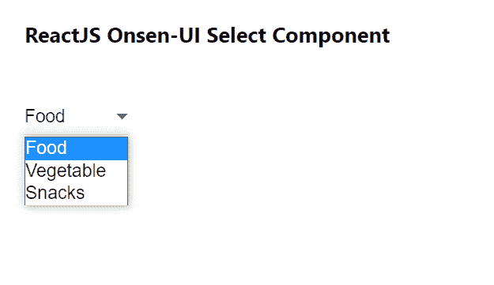

# 重新获取 Onsen 用户界面选择组件

> 原文:[https://www . geesforgeks . org/reactjs-onsen-ui-select-component/](https://www.geeksforgeeks.org/reactjs-onsen-ui-select-component/)

ReactJS Onsen-UI 是一个受欢迎的前端库，具有一组 React 组件，旨在以一种美观高效的方式开发 HTML5 混合和移动网络应用程序。选择组件允许用户从选项列表中选择一个项目。 我们可以在 ReactJS 中使用以下方法来使用 Onsen-UI 选择组件。

**选择道具:**

*   **修改器:**用于选择框的外观。
*   **禁用:**用于指定选择是否禁用。
*   **onChange:** 是一个回调函数，当 select 的值发生变化时触发。
*   **值:**用于设置所选值。
*   **多个:**如果该属性存在，可以一次选择多个选项。
*   **自动对焦:**用于使元素在页面加载时自动获得对焦。
*   **必选:**用于进行必选输入。
*   **表单:**用于将 select 元素与页面上的现有表单相关联，即使没有嵌套。
*   **大小:**用于表示显示多少个选项。

**预设修改器:**

*   **物料:**用于显示物料选择输入。
*   **下栏:**用于显示选择输入下方的水平线。

**创建反应应用程序并安装模块:**

*   **步骤 1:** 使用以下命令创建一个反应应用程序:

    ```
    npx create-react-app foldername
    ```

*   **步骤 2:** 创建项目文件夹(即文件夹名**)后，使用以下命令移动到该文件夹中:**

    ```
    cd foldername
    ```

*   **步骤 3:** 创建 ReactJS 应用程序后，使用以下命令安装所需的****模块:****

    ```
    **npm install onsenui react-onsenui** 
    ```

******项目结构:**如下图。****

****

项目结构**** 

******示例:**现在在 **App.js** 文件中写下以下代码。在这里，App 是我们编写代码的默认组件。****

## ****App.js****

```
**import React from 'react';
import 'onsenui/css/onsen-css-components.css';
import { Select } from 'react-onsenui';

export default function App() {

  return (
    <div style={{
      display: 'block', width: 500, paddingLeft: 30
    }}>
      <h6>ReactJS Onsen-UI Select Component</h6>
      <Select modifier="material">
        <option value="1">Food</option>
        <option value="2">Vegetable</option>
        <option value="3">Snacks</option>
      </Select>
    </div>
  );
}**
```

******运行应用程序的步骤:**从项目的根目录使用以下命令运行应用程序:****

```
**npm start**
```

******输出:**现在打开浏览器，转到***http://localhost:3000/***，会看到如下输出:****

********

******参考:**T2】https://onsen.io/v2/api/react/Select.html****