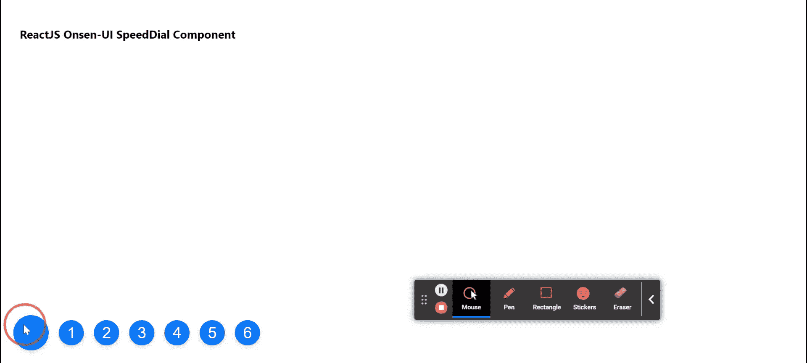

# 重新获取 Onsen UI 快速拨号组件

> 原文:[https://www . geeksforgeeks . org/reactjs-onsen-ui-speed dial-component/](https://www.geeksforgeeks.org/reactjs-onsen-ui-speeddial-component/)

ReactJS Onsen-UI 是一个受欢迎的前端库，具有一组 React 组件，旨在以一种美观高效的方式开发 HTML5 混合和移动网络应用程序。快速拨号组件允许用户从可用的快速动作按钮执行动作。我们可以在 ReactJS 中使用以下方法来使用 Onsen-UI 快速拨号组件。

**速度拨号道具：**

*   **修饰词:**用于快速拨号的外观。
*   **位置:**用于指定构件的垂直和水平位置。
*   **方向:**用于指定项目显示的方向。
*   **禁用:**用于指定按钮是否禁用。

**创建反应应用程序并安装模块:**

*   **步骤 1:** 使用以下命令创建一个反应应用程序:

    ```
    npx create-react-app foldername
    ```

*   **步骤 2:** 创建项目文件夹(即文件夹名**)后，使用以下命令移动到该文件夹中:**

    ```
    cd foldername
    ```

*   **步骤 3:** 创建 ReactJS 应用程序后，使用以下命令安装所需的****模块:****

    ```
    **npm install onsenui react-onsenui** 
    ```

******项目结构:**如下图。****

****

项目结构**** 

******示例:**现在在 **App.js** 文件中写下以下代码。在这里，App 是我们编写代码的默认组件。****

## ****App.js****

```
**import React from 'react';
import 'onsenui/css/onsen-css-components.css';
import { SpeedDial, SpeedDialItem, Fab, Icon } 
        from 'react-onsenui';

export default function App() {

  return (
    <div style={{
      display: 'block', width: 500, paddingLeft: 30
    }}>
      <h6>ReactJS Onsen-UI SpeedDial Component</h6>
      <SpeedDial direction='right' disabled={false} 
              position='left bottom'>
        <Fab><Icon size={26} style=
            {{ verticalAlign: 'middle' }} />
        </Fab>
        <SpeedDialItem>1</SpeedDialItem>
        <SpeedDialItem>2</SpeedDialItem>
        <SpeedDialItem>3</SpeedDialItem>
        <SpeedDialItem>4</SpeedDialItem>
        <SpeedDialItem>5</SpeedDialItem>
        <SpeedDialItem>6</SpeedDialItem>
      </SpeedDial>
    </div>
  );
}**
```

******运行应用程序的步骤:**从项目的根目录使用以下命令运行应用程序:****

```
**npm start**
```

******输出:**现在打开浏览器，转到***http://localhost:3000/***，会看到如下输出:****

********

******参考:**T2】https://onsen.io/v2/api/react/SpeedDial.html****