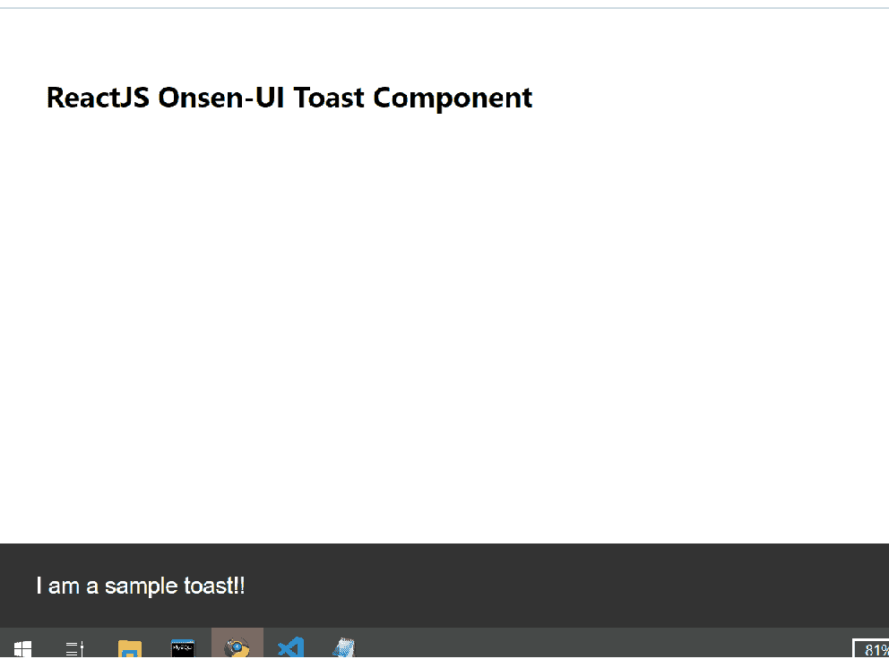

# 重新获取 Onsen UI 吐司组件

> 原文:[https://www . geeksforgeeks . org/reactjs-onsen-ui-toast-component/](https://www.geeksforgeeks.org/reactjs-onsen-ui-toast-component/)

ReactJS Onsen-UI 是一个受欢迎的前端库，具有一组 React 组件，旨在以一种美观高效的方式开发 HTML5 混合和移动网络应用程序。Toast 组件允许用户在页面底部显示可解雇信息或简单操作。  我们可以在 ReactJS 中使用以下方法来使用 Onsen-UI 吐司组件。

**吐司道具:**

*   **isOpen:** 用于表示吐司是否打开并显示。
*   **动画:**用于表示动画名称，如默认、上升、上升、下降、淡化或无。
*   **修饰语:**用于吐司的外观。
*   **动画选项:**用于指定动画的持续时间、延迟和定时。
*   **onreshow:**是一个回调函数，刚好在吐司显示之前触发。
*   **onPostShow:** 是吐司刚显示完就触发的回调函数。
*   **onPreHide:** 是一个回调函数，就在吐司被隐藏之前触发。
*   **onpostshide:**是吐司刚隐藏完就触发的回调函数。
*   **onDeviceBackButton:** 是设备后退按钮的自定义处理程序。

**创建反应应用程序并安装模块:**

*   **步骤 1:** 使用以下命令创建一个反应应用程序:

    ```jsx
    npx create-react-app foldername
    ```

*   **步骤 2:** 在创建项目文件夹(即文件夹名**)后，使用以下命令将**移动到该文件夹:

    ```jsx
    cd foldername
    ```

*   **步骤 3:** 创建 ReactJS 应用程序后，使用以下命令安装所需的****模块:****

    ```jsx
    **npm install onsenui react-onsenui** 
    ```

******项目结构:**如下图。****

****

项目结构**** 

******示例:**现在在 **App.js** 文件中写下以下代码。在这里，App 是我们编写代码的默认组件。****

## ****App.js****

```jsx
**import React from 'react';
import 'onsenui/css/onsen-css-components.css';
import { Toast } from 'react-onsenui';

export default function App() {

    return (
        <div style={{
            display: 'block', width: 500, paddingLeft: 30
        }}>
            <h6>ReactJS Onsen-UI Toast Component</h6>
            <Toast
                modifier={'material'}
                isOpen={true}
            >I am a sample toast!!</Toast>
        </div>
    );
}**
```

******运行应用程序的步骤:**从项目的根目录使用以下命令运行应用程序:****

```jsx
**npm start**
```

******输出:**现在打开浏览器，转到***http://localhost:3000/***，会看到如下输出:****

********

******参考:**[https://onsen . io/v2/API/reac/toast . html](https://onsen.io/v2/api/react/Toast.html)****