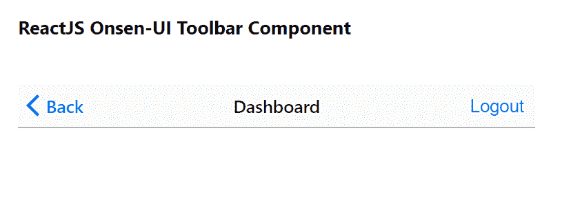

# 重新获取 Onsen UI 工具栏组件

> 原文:[https://www . geeksforgeeks . org/reactjs-onsen-ui-toolbar-component/](https://www.geeksforgeeks.org/reactjs-onsen-ui-toolbar-component/)

ReactJS Onsen-UI 是一个受欢迎的前端库，具有一组 React 组件，旨在以一种美观高效的方式开发 HTML5 混合和移动网络应用程序。工具栏组件允许用户向他们展示一个可以与导航一起使用的工具栏。我们可以在 ReactJS 中使用以下方法来使用 Onsen-UI 工具栏组件。

**工具栏道具:**

*   **修改器:**用于指定修改器名称，以指定自定义样式。
*   **可见:**如果设置为真，工具栏会显示在屏幕上。

**预设修改器:**

*   **材质:**用于显示材质设计工具栏。
*   **透明:**用于使工具栏透明。
*   **封面-内容:**用于在页面内容上方显示工具栏。
*   **noshadow:** 用于没有阴影的工具栏。

**创建反应应用程序并安装模块:**

**步骤 1:** 使用以下命令创建一个反应应用程序:

```jsx
npx create-react-app foldername
```

**步骤 2:** 在创建项目文件夹(即文件夹名**)后，使用以下命令将**移动到该文件夹:

```jsx
cd foldername
```

**步骤 3:** 创建 ReactJS 应用程序后，使用以下命令安装所需的****模块:****

```jsx
**npm install onsenui react-onsenui** 
```

******项目结构:**如下图。****

****

项目结构**** 

******示例:**现在在 **App.js** 文件中写下以下代码。在这里，App 是我们编写代码的默认组件。****

## ****java 描述语言****

```jsx
**import React from 'react';
import 'onsenui/css/onsen-css-components.css';
import { Toolbar, BackButton, ToolbarButton } from 'react-onsenui';

export default function App() {

  return (
    <div style={{
      display: 'block', width: 500, paddingLeft: 30
    }}>
      <h6>ReactJS Onsen-UI Toolbar Component</h6>
      <Toolbar>
        <div className="left">
          <BackButton>Back</BackButton>
        </div>
        <div className="center">Dashboard</div>
        <div className="right">
          <ToolbarButton>Logout</ToolbarButton>
        </div>
      </Toolbar>
    </div>
  );
}**
```

******运行应用程序的步骤:**从项目的根目录使用以下命令运行应用程序:****

```jsx
**npm start**
```

******输出:**现在打开浏览器，转到***http://localhost:3000/***，会看到如下输出:****

********

******参考:**T2】https://onsen.io/v2/api/react/Toolbar.html****