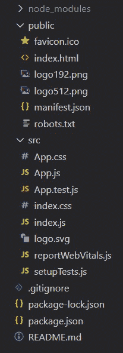

# 反应堆入口

> 原文:[https://www.geeksforgeeks.org/reactjs-portals/](https://www.geeksforgeeks.org/reactjs-portals/)

反应门户想出一个方法，将子节点渲染到父组件的 [**<u>DOM 层次结构</u>**](https://www.geeksforgeeks.org/reactjs-virtual-dom/) 之外的[](https://www.geeksforgeeks.org/dom-document-object-model/)<u>节点中。门户在 **React 16.0 版本**中引入。</u>

<u>到目前为止，我们在 HTML 中有一个 DOM 元素，我们将我们的 react 应用程序装入其中，即公共文件夹中我们的**index.html**的根元素。基本上，我们将**应用程序**组件安装到根元素上。拥有一个 id 为**根**的 div 元素作为根 DOM 元素几乎是一种惯例。如果您看一下 DOM 树中的浏览器，我们应用程序中的每个单独的 React 组件都属于根元素，即在这个语句中。</u>

```jsx
<div id="root"></div>
```

<u>但是 React Portals 为我们提供了打破这个 dom 树的能力，并将组件呈现到不在这个根元素下的 dom 节点上。这样做打破了组件需要作为新元素呈现并遵循父子层次结构的惯例。它们通常用于模式对话框、悬浮卡、加载器和弹出消息。</u>

<u>**语法:**</u>

```jsx
ReactDOM.createPortal(child, container)
```

<u>**参数:**这里第一个参数是一个**子**，它可以是一个 React 元素、字符串或片段，第二个参数是一个**容器**，它是位于父组件的 DOM 层次结构之外的 DOM 节点(或位置)，我们的门户将被插入到这个 DOM 节点中。</u>

<u>**导入:**要创建和使用门户，您需要导入**反应堆模块**，如下所示。</u>

```jsx
import ReactDOM from 'react-dom';
```

<u>**创建反应应用程序:**</u>

*   <u>**步骤 1:** 使用以下命令创建一个 [**<u>React 应用程序</u>**](https://www.geeksforgeeks.org/reactjs-setting-development-environment/) 。</u>

    ```jsx
    npx create-react-app foldername
    ```

*   <u>**步骤 2:** 创建项目文件夹(即文件夹名)后，使用以下命令移动到该文件夹。</u>

    ```jsx
    cd foldername
    ```

<u>**项目结构:**如下图。</u>

<u></u>

<u>**示例:**现在在 App.js 文件中写下以下代码。在这里，App 是我们编写代码的默认组件。</u>

## <u>App.js</u>

```jsx
import ReactDOM from 'react-dom'
function App() {

  // Creating a portal
  return ReactDOM.createPortal(
    <h1>Portal demo</h1>,
    document.getElementById('portal')
 )
}

export default App;
```