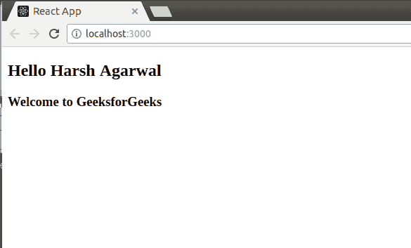
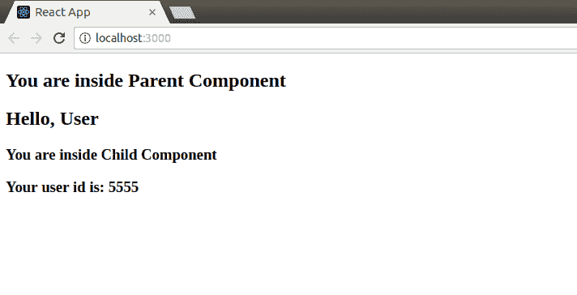
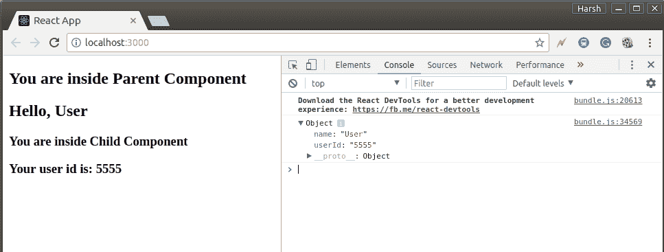

# 反应|道具–第 1 套

> 原文:[https://www.geeksforgeeks.org/reactjs-props-set-1/](https://www.geeksforgeeks.org/reactjs-props-set-1/)

我们已经在之前的文章 [ReactJS | Components](https://www.geeksforgeeks.org/reactjs-components/) 中讨论过组件及其类型。到目前为止，我们只使用静态数据来处理组件。在本文中，我们将了解如何向组件传递信息。
React 允许我们使用名为**的道具**(代表属性)向组件传递信息。道具基本上是一种全局变量或对象。我们将在本文中详细了解这些内容。

**传递和获取道具**

我们可以将道具传递给任何组件，就像我们为任何 HTML 标记声明属性一样。看看下面的代码片段:

```
<DemoComponent sampleProp = "HelloProp" />
```

在上面的代码片段中，我们将名为*样本道具*的**道具传递给名为*演示组件*的组件。这个道具的值是“HelloProp”。现在让我们看看如何才能获得这些道具。
我们可以从道具传递到的组件类中访问里面的任何道具。可以访问的道具如下所示:** 

```
this.props.*propName*;
```

我们可以使用上面的语法从组件类内部访问任何 prop。“this.props”是一种存储所有组件道具的全局对象。*道具名称*，即道具的名称是这个物体的关键。
下面是一个示例程序，说明如何从组件传递和访问道具:

打开您的 react 项目，在 src 文件夹中编辑 **App.js** 文件:

**src App.js:**

## java 描述语言

```
import React from 'react';
import ReactDOM from 'react-dom';

// sample component to illustrate props
class DemoComponent extends React.Component{
    render(){
        return(

                <div>
                    {/*accessing information from props */}
                    <h2>Hello {this.props.user}</h2>
                    <h3>Welcome to GeeksforGeeks</h3>
                </div>
            );
    }
}

ReactDOM.render(
    // passing props
    <DemoComponent user = "Harsh Agarwal" />,
    document.getElementById("root")
);
```

输出:



在上面的例子中，我们使用了一个基于类的组件来说明道具。但是我们可以**将道具传递给基于功能的组件**，就像我们在上面的例子中所做的那样。但是要从函数中访问一个道具，我们不再需要使用“this”关键字。功能组件接受道具作为参数，可以直接访问。下面是与上面相同的示例，但是这次使用了基于函数的组件而不是基于类的组件。

打开您的 react 项目，在 src 文件夹中编辑 **App.js** 文件:

**src App.js:**

## java 描述语言

```
import React from 'react';
import ReactDOM from 'react-dom';

// functional component to illustrate props
function DemoComponent(props){
    return(
        <div>
            {/*accessing information from props */}
            <h2>Hello {props.user}</h2>
            <h3>Welcome to GeeksforGeeks</h3>
         </div>
    );
}

ReactDOM.render(
    // passing props
    <DemoComponent user = "Harsh Agarwal" />,
    document.getElementById("root")
);
```

该程序的输出将与上述程序的输出相同。唯一不同的是，我们使用了基于函数的组件，而不是基于类的组件。

**将信息从一个组件传递到另一个组件**

这是 React 最酷的功能之一。我们可以让组件相互作用。我们将考虑父母和孩子两个部分来解释这一点。我们将把一些信息作为道具从父组件传递给子组件。**我们可以将任意多的道具传递给一个组件**。
看下面的代码:
打开你的 react 项目，在 src 文件夹中编辑 **App.js** 文件:

**src App.js:**

## java 描述语言

```
import React from 'react';
import ReactDOM from 'react-dom';

// Parent Component
class Parent extends React.Component{
    render(){
        return(
                <div>
                    <h2>You are inside Parent Component</h2>
                    <Child name="User" userId = "5555"/>
                </div>
            );
    }
}

// Child Component
class Child extends React.Component{
    render(){
        return(
                <div>
                    <h2>Hello, {this.props.name}</h2>
                    <h3>You are inside Child Component</h3>
                    <h3>Your user id is: {this.props.userId}</h3>
                </div>
            );
    }
}

ReactDOM.render(
    // passing props
    <Parent />,
    document.getElementById("root")
);
```

输出:



因此，我们已经在 React 中看到了道具，也了解了道具是如何使用的，它们是如何传递给组件的，它们是如何在组件内部被访问的，等等。在这个完整的场景中，我们经常使用“this.props.propName”这个东西来访问道具。现在让我们检查一下这个里面到底储存了什么。我们将在子组件内部的上述程序中记录 console . log“this . props”，并尝试观察记录到控制台中的内容。下面是用 console.log()语句修改的程序:

打开您的 react 项目，在 src 文件夹中编辑 **App.js** 文件:

**src App.js:**

## java 描述语言

```
import React from 'react';
import ReactDOM from 'react-dom';

// Parent Component
class Parent extends React.Component{
    render(){
        return(
                <div>
                    <h2>You are inside Parent Component</h2>
                    <Child name="User" userId = "5555"/>
                </div>
            );
    }
}

// Child Component
class Child extends React.Component{
    render(){
        console.log(this.props);
        return(
                <div>
                    <h2>Hello, {this.props.name}</h2>
                    <h3>You are inside Child Component</h3>
                    <h3>Your user id is: {this.props.userId}</h3>
                </div>
            );
    }
}

ReactDOM.render(
    // passing props
    <Parent />,
    document.getElementById("root")
);
```



在上图中可以清楚地看到，在控制台中显示 **this.props** 是一个对象，它包含传递给子组件的所有道具。子组件的道具名称是该对象的键，它们的值是这些键的值。因此，现在很清楚，使用道具传送到组件的任何信息都存储在对象内部。
**注**:道具只读。我们不允许修改道具的内容。不管组件是什么类型——功能性的还是基于类的，都不允许修改它们的道具。我们将在下一篇文章 [Reactjs |道具组-2](https://www.geeksforgeeks.org/reactjs-props-set-2/) 中详细了解这一点

**参考**:
T3】https://reactjs.org/docs/components-and-props.htmlT5】