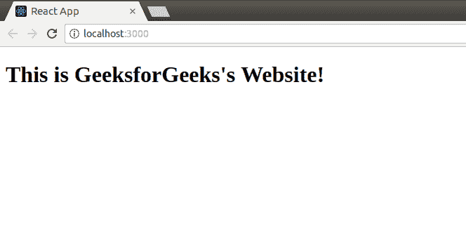
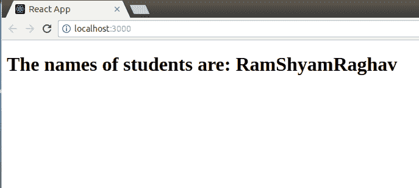
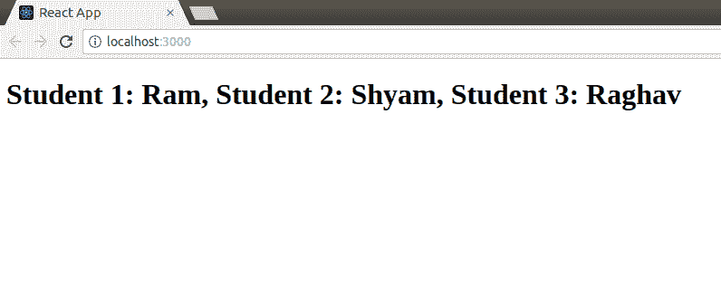

# 反应|道具–第二套

> 原文:[https://www.geeksforgeeks.org/reactjs-props-set-2/](https://www.geeksforgeeks.org/reactjs-props-set-2/)

在我们之前的文章 [ReactJS |道具–第 1 集](https://www.geeksforgeeks.org/reactjs-props-set-1/)中，我们已经讨论了道具、传递和访问道具、将道具从一个组件传递到另一个组件等。在本文中，我们将继续讨论道具。
那么，如果我们想使用道具将一些默认信息传递给我们的组件呢。React 允许我们这样做。React 为此向我们提供了一种叫做*默认道具*的东西。具体来看一下:

**defaultProps**

defaultProps 是一种方法，我们可以使用它来为特定的类存储我们想要的信息。这些信息可以从特定类中的任何地方访问。您在*默认道具*中添加的每一条信息，都将作为该类的道具添加。在这一点上，这似乎令人困惑。让我们看一个程序，我们将使用*默认道具*为一个类创建一些道具。

打开您的 react 项目目录，从 src 文件夹编辑 **App.js** 文件:

**src App.js:**

## java 描述语言

```
import React from 'react';
import ReactDOM from 'react-dom';

// Component
class ExampleClass extends React.Component{
    render(){
        return(
                <div>
                    {/* using default prop - title */}
                    <h1>This is {this.props.title}'s Website!</h1>
                </div>
            );
    }
}

// Creating default props for
// ExampleClass Component
ExampleClass.defaultProps = {
    title: "GeeksforGeeks"
}

ReactDOM.render(
    <ExampleClass />,
    document.getElementById("root")
);
```

输出:



你可以看到在上面的程序中，我们在类*之外创建了一个名为 *title* 的默认道具【范例类*，并使用 *this.props* 语句访问了该类中的这个道具。
我们也可以通过数组作为道具，而不是通过单个元素。让我们看看下面的程序是如何完成的:
打开你的 react 项目目录，从 src 文件夹中编辑 **App.js** 文件:

**src App.js:**

## java 描述语言

```
import React from 'react';
import ReactDOM from 'react-dom';

// Component
class ExampleClass extends React.Component{
    render(){
        return(
                <div>
                    {/* accessing array prop directly */}
                    <h1>The names of students are: {this.props.names}</h1>
                </div>
            );
    }
}

// Passing an array as prop
ExampleClass.defaultProps = {
    names: ['Ram', 'Shyam', 'Raghav']
}

ReactDOM.render(
    <ExampleClass />,
    document.getElementById("root")
);
```

在上面的程序中，我们将一个名称数组作为一个道具传递给了组件 ExampleClass。我们还直接访问了这个数组来打印数组的内容。以下是渲染上述代码时的输出:



在上面的输出中可以看到，直接使用 *this.props* 语句打印数组的内容，只是打印数组中的所有元素，没有任何格式。但这看起来不太好，对吧？这不是我们在其他编程语言中打印数组元素的方式。如果我们想在打印数组元素之前添加一些格式呢？或者换句话说，如果我们想要迭代作为道具传递的数组呢？为此，我们可以使用 JavaScript 中可用的 map()方法。我们必须将一个函数作为参数传递给 map 方法。该函数将接受两个参数，其中第一个是数组项，第二个是数组项的索引。要详细了解地图()，请访问[这个](https://developer.mozilla.org/en-US/docs/Web/JavaScript/Reference/Global_Objects/Array/map)链接。让我们看看下面的代码，其中我们使用 map()方法迭代作为 defaultProp 传递给组件的数组:

打开您的 react 项目目录，从 src 文件夹编辑 **App.js** 文件:

**src App.js:**

## java 描述语言

```
import React from 'react';
import ReactDOM from 'react-dom';

// Component
class ExampleClass extends React.Component{
    render(){
        return(
                <div>
                    {/* iterating over array using map() */}
                    <h1>{this.props.names.map(
                        function namesIterator(item,i){
                            return (
                                    "Student "+ (i+1) +": " +
                                     item+
                                     ((i!=2)?',  ':'\n')
                                )
                        }

                        )}</h1>
                </div>
            );
    }
}

// Passing an array as prop
ExampleClass.defaultProps = {
    names: ['Ram', 'Shyam', 'Raghav']
}

ReactDOM.render(
    <ExampleClass />,
    document.getElementById("root")
);
```

输出:



您可以在上面的程序中看到我们如何使用 map()迭代传递给组件*的数组。
本文就到这里。在我们的下一篇文章中，我们将看到如何验证道具中的类型，或者如何执行类型检查。*