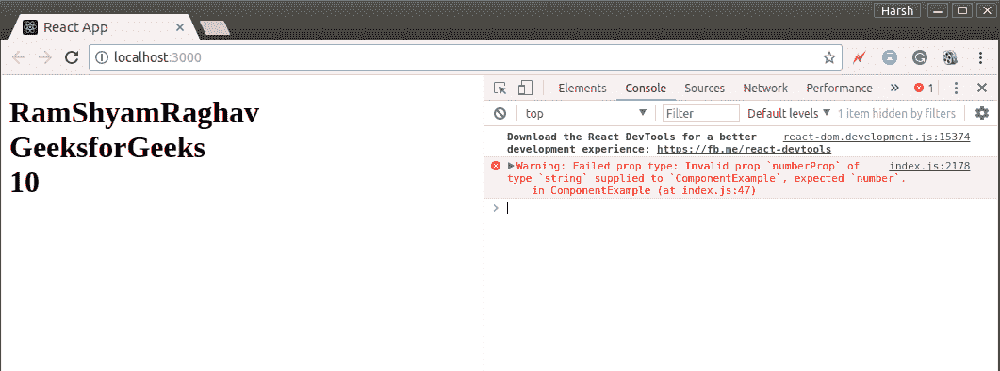

# 反作用|推进剂类型

> 哎哎哎:# t0]https://www . geeksforgeeks . org/reacjs-proptypes/

在我们之前关于道具的文章中，我们已经看到了如何使用道具向任何组件传递信息。我们传递了不同类型的信息，如整数、字符串、数组等。作为组件的道具。让我们回忆一下我们如何将这些道具传递给组件的过程。我们可以创建默认道具，也可以直接将道具作为属性传递给组件。我们从组件外部传递道具，并在组件内部使用它们。但是我们有没有检查过我们通过道具在组件中得到什么类型的值？不，我们没有。但是后来一切都很好。
我们是否使用组件中的道具验证我们获得的数据完全取决于我们。但是对于更大的应用程序，验证我们通过道具获得的数据总是一个很好的做法。这将有助于调试，也有助于避免将来出现错误。让我们看看如何做到这一点。

试剂中的丙烯类型

在发布 react 15.5.0 版本之前，propTypes 在 React 包中可用，但是在 React 的更高版本中，必须在项目中添加依赖项。您可以使用下面给出的命令在项目中添加依赖项:

```jsx
npm install prop-types --save
```

我们可以使用*道具类型*来验证我们从道具接收的任何数据。但是在使用它之前，我们必须导入它。在你的 index.js 文件的顶部添加下面一行:

```jsx
import PropTypes from 'prop-types';
```

一旦我们导入了 propTypes，我们就可以使用它们了。就像 defaultProps 一样，propTypes 也是对象，其中键是 prop 名称，值是它们的类型。下面的语法显示了如何使用 propTypes:

```jsx
*ComponentClassName*.propTypes{

    propName1 : PropTypes.string,
    propName2 : PropTypes.bool,
    propName3 : PropTypes.array,
    .
    .
    .
    .
    propNamen : PropTypes.*anyOtherType*
}
```

在上面的语法中， *ComponentClassName* 是 Component 类的名称， *anyOtherType* 可以是我们允许作为道具传递的任何类型。对于不验证 propTypes 指定的数据类型的道具，控制台上将出现警告。为了更好地理解，让我们看看一个使用 propTypes 进行验证的完整程序:

## java 描述语言

```jsx
import PropTypes from 'prop-types';
import React from 'react';
import ReactDOM from 'react-dom';

// Component
class ComponentExample extends React.Component{
    render(){
        return(
                <div>

                    {/* printing all props */}
                    <h1>
                        {this.props.arrayProp}
                        <br />

                        {this.props.stringProp}
                        <br />

                        {this.props.numberProp}
                        <br />

                        {this.props.boolProp}
                        <br />
                    </h1>
                </div>
            );
    }
}

// Validating prop types
ComponentExample.propTypes = {
    arrayProp: PropTypes.array,
    stringProp: PropTypes.string,
    numberProp: PropTypes.number,
    boolProp: PropTypes.bool,
}

// Creating default props
ComponentExample.defaultProps = {

    arrayProp: ['Ram', 'Shyam', 'Raghav'],
    stringProp: "GeeksforGeeks",
    numberProp: "10",
    boolProp: true,
}

ReactDOM.render(
    <ComponentExample  />,
    document.getElementById("root")
);
```

输出:



您可以在上面的程序中看到，我们将名为 *numberProp* 的道具作为字符串传递，但将其验证为数字。尽管如此，一切都在浏览器上完美呈现，但是我们的浏览器控制台有一条警告消息。这条消息清楚地告诉我们，名为*数字道具*的道具应该包含一个数值，但是传递的是一个字符串值。你可以去 [ReactJS](https://reactjs.org/docs/typechecking-with-proptypes.html) 的官方文档查看道具可以使用的所有有效类型。
**注**:在最近版本的 React 中 **React。PropTypes 被移动到一个不同的包中，**为了使用它，我们将不得不单独安装那个包。请访问 https://www.npmjs.com/package/prop-types 链接获取安装说明。