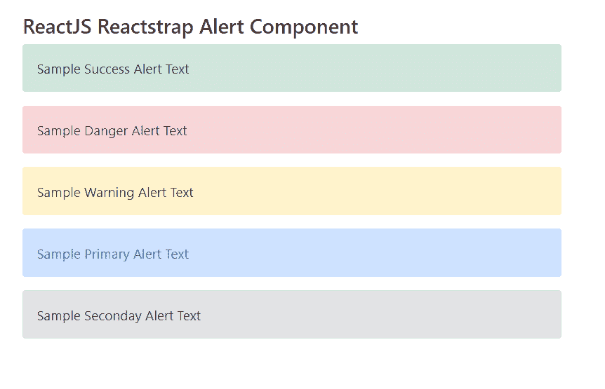

# 反应堆捕捉报警组件

> 原文:[https://www . geeksforgeeks . org/reactjs-reatstrap-alert-component/](https://www.geeksforgeeks.org/reactjs-reactstrap-alert-component/)

**React trap**:React trap 是一个流行的前端库，很容易使用 React Bootstrap 4 组件。该库包含引导 4 的无状态反应组件。警报组件用于紧急中断，要求确认通知用户情况。我们可以在 reatjs 中使用以下方法来使用 ReactJS Reactstrap 警报组件。

**创建反应应用程序并安装模块:**

**步骤 1:** 使用以下命令创建一个反应应用程序:

```
npx create-react-app foldername
```

**步骤 2:** 创建项目文件夹后，即文件夹名称**，**使用以下命令移动到项目文件夹:

```
cd foldername
```

**步骤 3:** 创建 ReactJS 应用程序后，使用以下命令安装所需的****模块:****

```
**npm install reactstrap bootstrap**
```

******项目结构:**如下图。****

****

项目结构**** 

******示例:**现在在 **App.js** 文件中写下以下代码。在这里，应用程序是我们编写代码的默认组件。****

## ****java 描述语言****

```
**import React from 'react'
import 'bootstrap/dist/css/bootstrap.min.css';
import { Alert } from "reactstrap"

function App() {
    return (
        <div style={{
            display: 'block', width: 700, padding: 30
        }}>
            <h4>ReactJS Reactstrap Alert Component</h4>
            <Alert color="success">
                Sample Success Alert Text
            </Alert>
            <Alert color="danger">
                Sample Danger Alert Text
            </Alert>
            <Alert color="warning">
                Sample Warning Alert Text
            </Alert>
            <Alert color="primary">
                Sample Primary Alert Text
            </Alert>
            <Alert color="secondary">
                Sample Seconday Alert Text
            </Alert>
        </div>
    );
}

export default App;**
```

******运行应用程序的步骤:**从项目的根目录使用以下命令运行应用程序:****

```
**npm start**
```

******输出:******

****现在打开浏览器，转到***http://localhost:3000/***，会看到如下输出:****

********

******参考:**T2】https://reactstrap.github.io/components/alerts/****