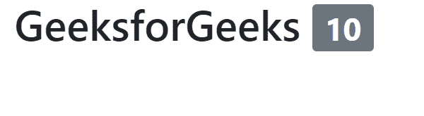
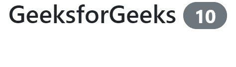
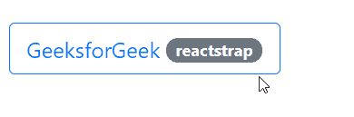

# 反应堆安全壳徽章组件

> 原文:[https://www . geeksforgeeks . org/reactjs-reatstrap-徽章-组件/](https://www.geeksforgeeks.org/reactjs-reactstrap-badges-component/)

Reactstrap 是一个基于引导的 react UI 库，通过其无缝且易于使用的组件来制作好看的网页。

在本文中，我们将了解如何在 Reactstrap 中使用徽章组件。徽章用于创建标签。徽章通过使用相对字体大小来缩放以匹配直接父元素的大小。

**语法:**

```jsx
<badge>Content</badge>
```

**创建反应应用程序并安装模块:**

*   **步骤 1:** 使用以下命令创建一个反应应用程序:

    ```jsx
    npx create-react-app foldername
    ```

*   **步骤 2:** 在创建项目文件夹(即文件夹名**)后，使用以下命令将**移动到该文件夹:

    ```jsx
    cd foldername
    ```

*   **步骤 3:** 创建 ReactJS 应用程序后，使用以下命令安装所需的****模块:****

    ```jsx
    **npm install reactstrap bootstrap**
    ```

******项目结构**:如下图。****

********

******运行应用程序的步骤:**使用以下命令从项目的根目录运行应用程序。****

```jsx
**npm start**
```

******示例 1:** 这是展示如何使用 Badge 组件的基本示例。****

## ****App.js****

```jsx
**import React from 'react';
import { Badge } from 'reactstrap';

const Example = (props) => {
  return (
    <div>
      <h1>GeeksforGeeks <Badge color="secondary">10</Badge></h1>
    </div>
  );
}

export default Example;**
```

******输出:******

********

******例 2:** 在本例中，我们将制作药丸型徽章。****

## ****App.js****

```jsx
**import React from 'react';
import { Badge } from 'reactstrap';

const Example = (props) => {
  return (
    <div>
      <h1>GeeksforGeeks <Badge color="secondary" pill>10</Badge></h1>
    </div>
  );
}

export default Example;**
```

******输出:******

********

******示例 3:** 在本例中，我们使用的徽章显示悬停效果。****

*   ******App.js******

## ****java 描述语言****

```jsx
**import React from 'react';
import { Badge, Button } from 'reactstrap';

const gfg = (props) => {
  return (
    <div>
      <br/>
      <Button color="primary" outline>
        GeeksforGeek <Badge color="secondary" pill>reactstrap</Badge>
      </Button>
    </div>
  );
};

export default gfg;**
```

******输出:******

********

******参考:**https://reactstrap.github.io/components/badge/****