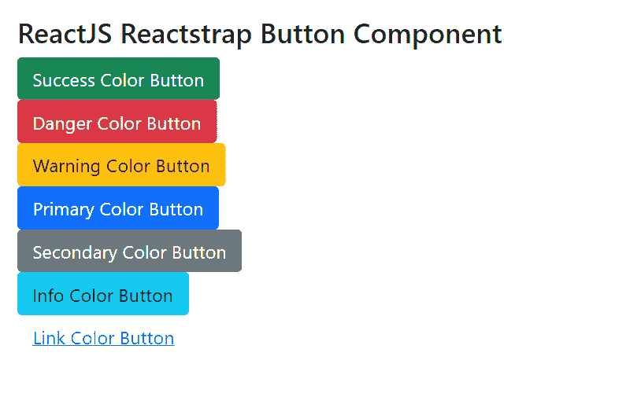
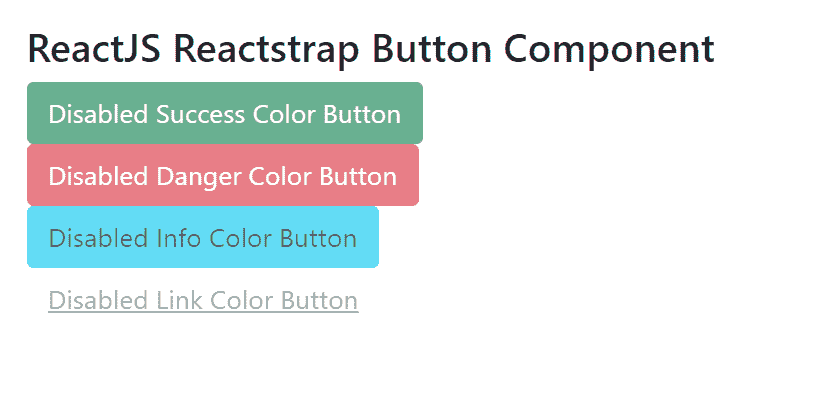

# 反应堆捕捉按钮组件

> 原文:[https://www . geeksforgeeks . org/reactjs-reatstrap-button-component/](https://www.geeksforgeeks.org/reactjs-reactstrap-button-component/)

Reactstrap 是一个流行的前端库，易于使用 React Bootstrap 4 组件。该库包含引导 4 的无状态反应组件。按钮组件允许用户通过一次点击来采取行动和做出选择。我们可以在 reatjs 中使用以下方法来使用 ReactJS Reactstrap 按钮组件。

**纽扣道具:**

*   **激活:**reatstrap 中的激活道具用于手动将按钮设置为激活状态。
*   **咏叹调标签:**这个咏叹调标签道具用来表示标记当前元素的字符串。它用于屏幕不可见的地方。
*   **区块:**按钮道具用于指示按钮是否应该具有区块样式。
*   **颜色:**reacts trap 中的颜色道具用于设置组件中元素的颜色。
*   **禁用**:禁用道具用于设置禁用按钮。它将按钮转换到非活动状态。
*   **轮廓:**轮廓道具用来表示按钮是否要有轮廓样式。
*   **innerRef:** 这个道具用来表示元素的内部引用。innerRef 是一个自定义属性，由项目中的开发人员使用。
*   **onClick:** 当回调函数被触发，并且一个按钮被点击时，onClick 属性被调用。
*   **大小:**这些道具用来指定按钮的大小
*   **cssModule:** 这个按钮道具用来表示组件样式的 CSS 模块。

**创建 React 应用程序和安装模块的语法:**

**步骤 1:** 使用以下命令创建一个反应应用程序:

```jsx
npx create-react-app foldername
```

**步骤 2:** 创建项目文件夹后，即文件夹名称**，**使用以下命令移动到项目文件夹:

```jsx
cd foldername
```

**步骤 3:** 创建 ReactJS 应用程序后，使用以下命令安装所需的****模块:****

```jsx
**npm install reactstrap bootstrap**
```

******项目结构:**如下图。****

****

项目结构**** 

******示例 1:** 现在在 **App.js** 文件中写下以下代码。这里，我们显示了没有禁用状态的按钮。****

******文件名:App.js******

## ****java 描述语言****

```jsx
**import React from 'react'
import 'bootstrap/dist/css/bootstrap.min.css';
import { Button } from "reactstrap"

function App() {
    return (
        <div style={{
            display: 'block', width: 700, padding: 30
        }}>
            <h4>ReactJS Reactstrap Button Component</h4>
            <Button color="success">Success Color Button</Button> <br></br>
            <Button color="danger">Danger Color Button</Button> <br></br>
            <Button color="warning">Warning Color Button</Button> <br></br>
            <Button color="primary">Primary Color Button</Button> <br></br>
            <Button color="secondary">Secondary Color Button</Button> <br></br>
            <Button color="info">Info Color Button</Button> <br></br>
            <Button color="link">Link Color Button</Button>
        </div>
    );
}

export default App;**
```

******运行应用程序的步骤:**从项目的根目录使用以下命令运行应用程序:****

```jsx
**npm start**
```

******输出:**现在打开浏览器，转到***http://localhost:3000/***，会看到如下输出:****

********

******示例 2:** 现在在 **App.js** 文件中写下以下代码。这里，我们展示了带有禁用状态的按钮。****

******文件名:App.js******

## ****java 描述语言****

```jsx
**import React from 'react'
import 'bootstrap/dist/css/bootstrap.min.css';
import { Button } from "reactstrap"

function App() {
    return (
        <div style={{
            display: 'block', width: 700, padding: 30
        }}>
            <h4>ReactJS Reactstrap Button Component</h4>
            <Button color="success"
                disabled>Disabled Success Color Button</Button> <br></br>
            <Button color="danger"
                disabled>Disabled Danger Color Button</Button> <br></br>
            <Button color="info"
                disabled>Disabled Info Color Button</Button> <br></br>
            <Button color="link"
                disabled>Disabled Link Color Button</Button>
        </div>
    );
}

export default App;**
```

******运行应用程序的步骤:**从项目的根目录使用以下命令运行应用程序:****

```jsx
**npm start**
```

******输出:**现在打开浏览器，转到***http://localhost:3000/***，会看到如下输出:****

********

******参考:**T2】https://reactstrap.github.io/components/buttons/****