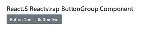
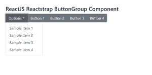

# 反应堆捕捉按钮组组件

> 原文:[https://www . geeksforgeeks . org/reactjs-reatstrap-button group-component/](https://www.geeksforgeeks.org/reactjs-reactstrap-buttongroup-component/)

Reactstrap 是一个流行的前端库，易于使用 React Bootstrap 4 组件。该库包含引导 4 的无状态反应组件。**按钮组** 组件用于将相关按钮组合在一起。该组件用于用户需要将按钮作为一组一起显示时。我们可以在 ReactJS 中使用以下方法来使用 ReactJS Reactstrap 按钮组组件。

按钮组提议:

*   **ariaLabel:** 这个道具用来表示组件的 aria-label 属性值。
*   **类名:**这个道具用来表示造型的类名。
*   **角色:**这个道具用来表示组件的角色属性。
*   **大小:**这个道具用来表示按钮的大小。
*   **垂直:**这个道具是用来表示是否在垂直方向显示按钮的。

**创建反应应用程序并安装模块:**

**步骤 1:** 使用以下命令创建一个反应应用程序:

```jsx
npx create-react-app foldername
```

**步骤 2:** 在创建项目文件夹(即文件夹名**)后，使用以下命令将**移动到该文件夹:

```jsx
cd foldername
```

**步骤 3:** 创建 React.js 应用程序后，使用以下命令安装所需的****模块:****

```jsx
**npm install reactstrap bootstrap**
```

******项目结构:**如下图。****

****

**项目结构****** 

******示例 1:** 现在在 **App.js** 文件中写下以下代码。这里，我们显示了没有下拉组件的按钮组组件。****

## ****App.js****

```jsx
**import React from 'react'
import 'bootstrap/dist/css/bootstrap.min.css';
import { ButtonGroup, Button } from "reactstrap"

function App() {
    return (
        <div style={{
            display: 'block', width: 700, padding: 30
        }}>
            <h4>ReactJS Reactstrap ButtonGroup Component</h4>
            <ButtonGroup>
                <Button>Button One</Button>
                <Button>Button Two</Button>
            </ButtonGroup>
        </div>
    );
}

export default App;**
```

******运行应用程序的步骤:**从项目的根目录使用以下命令运行应用程序:****

```jsx
**npm start**
```

******输出:**现在打开浏览器，转到***http://localhost:3000/***，会看到如下输出:****

****

**输出****** 

******示例 2:** 现在在 **App.js** 文件中写下以下代码。这里，我们展示了带有下拉组件的按钮组组件。****

## ****App.js****

```jsx
**import React from 'react'
import 'bootstrap/dist/css/bootstrap.min.css';
import {
    ButtonGroup, ButtonDropdown,
    DropdownMenu, DropdownItem, DropdownToggle, Button
} from "reactstrap"

function App() {

    // State for open state of dropdown
    const [isOpen, setIsOpen] = React.useState(true)

    return (
        <div style={{
            display: 'block', width: 700, padding: 30
        }}>
            <h4>ReactJS Reactstrap ButtonGroup Component</h4>
            <ButtonGroup>
                <ButtonDropdown toggle={() => setIsOpen(!isOpen)}
                    isOpen={isOpen}>
                    <DropdownToggle caret>Options</DropdownToggle>
                    <DropdownMenu>
                        <DropdownItem>Sample Item 1</DropdownItem>
                        <DropdownItem>Sample Item 2</DropdownItem>
                        <DropdownItem>Sample Item 3</DropdownItem>
                        <DropdownItem>Sample Item 4</DropdownItem>
                    </DropdownMenu>
                </ButtonDropdown>
                <Button>Button 1</Button>
                <Button>Button 2</Button>
                <Button>Button 3</Button>
                <Button>Button 4</Button>
            </ButtonGroup>
        </div>
    );
}

export default App;**
```

******运行应用程序的步骤:**从项目的根目录使用以下命令运行应用程序:****

```jsx
**npm start**
```

******输出:**现在打开浏览器，转到***http://localhost:3000/***，会看到如下输出:****

****

**输出:****** 

******参考:**T2】https://reactstrap.github.io/components/button-group/****